# WAD - Web Application Document - Módulo 2 - Inteli

**_Os trechos em itálico servem apenas como guia para o preenchimento da seção. Por esse motivo, não devem fazer parte da documentação final_**

## Grupo CLOUDING 

#### Integrantes:

- <a href="https://www.linkedin.com/in/aira-mel-76325734a/">Aira Mel</a>
- <a href="https://www.linkedin.com/in/caio-mota-78983732a/">Caio Mota</a>
- <a href="https://www.linkedin.com/in/jos%C3%A9-lima-684597301/">José Lima</a> 
- <a href="https://www.linkedin.com/in/lucas-lopes-8072b235a/">Lucas Lopes</a> 
- <a href="https://www.linkedin.com/in/sara-sbardelotto/">Sara Sbardelotto</a>
- <a href="https://www.linkedin.com/in/teodoroneira/">Teodoro Neira</a> 
- <a href="https://www.linkedin.com/in/yudi-omaki/">Yudi Omaki</a>


## Sumário

[1. Introdução](#c1)

[2. Visão Geral da Aplicação Web](#c2)

[3. Projeto Técnico da Aplicação Web](#c3)

[4. Desenvolvimento da Aplicação Web](#c4)

[5. Testes da Aplicação Web](#c5)

[6. Estudo de Mercado e Plano de Marketing](#c6)

[7. Conclusões e trabalhos futuros](#c7)

[8. Referências](c#8)

[Anexos](#c9)

<br>

# <a name="c1"></a>1. Introdução (sprints 1 a 5)

O IPT, Instituto de Pesquisas Tecnológicas, atua há mais de um século como arquiteto do futuro, buscando e produzindo soluções sustentáveis por meio da ciência e da tecnologia. Associado ao Governo do Estado de São Paulo, atua como agente de transformação social, além de pesquisar, desenvolver e aplicar soluções tecnológicas inovadoras para diversos setores.

Atualmente, o Laboratório de Tecnologia e Desempenho e Sistemas Construtivos (LTDC), da área de Habitação e Edificações no IPT, possui um sistema de registro manual de dados e imagens para a avaliação e inspeção técnica de edificações e obras. O método adotado resulta em processos demorados, suscetíveis a erros e pouco produtivo, dificultando não só o registro das irregularidades, como também a organização e transferência dos dados para os relatórios finais.

Portanto, o grupo CLOUDing propõe uma aplicação web que automatize as inspeções prediais. Essa solução visa acelerar e centralizar o processo de coleta e registro das avaliações e inspeções, integrando fotos, identificações e descrições.

Os pontos citados buscam não apenas desenvolver uma solução que digitalize o processo de inspeção predial, mas também aumente a eficiência operacional e a confiabilidade dos serviços prestados.

# <a name="c2"></a>2. Visão Geral da Aplicação Web (sprint 1)

## 2.1. Escopo do Projeto (sprints 1 e 4)

### 2.1.1. Modelo de 5 Forças de Porter (sprint 1)

A Cinco Forças de Porter é um modelo voltado para análise setorial, com o objetivo de entender quão atrativa e competitiva é determinada indústria. Essa abordagem permite que as empresas avaliem sua posição no mercado de forma estratégica, compreendendo as principais forças da concorrência em seu setor, para assim desenvolver estratégias que aumentem seus lucros e melhorem sua vantagem competitiva (MAGRETTA, 2019).

Portanto, na figura 1, é apresentada como as 5 Forças de Porter se aplicam e relacionam no setor em que o IPT está inserido.

<div align="center">
<sub>Figura 1 - 5 Forças de Porter</sub>
</div>

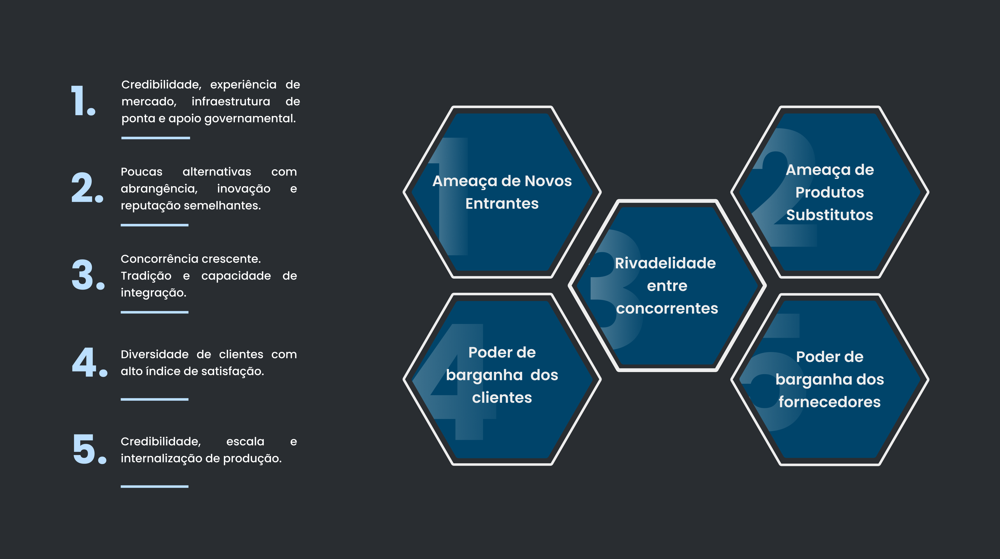

<div align="center">
</div>

<div align="center">
<sub>Fonte: autoria própria (2025)</sub>
</div>

#### Ameaça de Novos Entrantes (baixa)
O IPT, que atua no mercado há mais de um século, detém uma infraestrutura de ponta e uma equipe multidisciplinar altamente capacitada, o que reduz a ameaça de novos entrantes com nível similar de capital, conhecimento técnico e reputação. Além dos vínculos Governamentais e as parcerias estratégicas com empresas e universidades que enfatizam sua posição sólida e dificultam a entrada de novas empresas no setor (IPT, 2025).

#### Ameaça de Produtos Substitutos (moderada)
Apesar de existirem outras instituições de ciência e tecnologia (ICTs), universidades e consultorias privadas que oferecem serviços similares, poucas possuem amplitude, infraestrutura e reconhecimento consolidado similar ao do IPT (SEESP, 2021). Sua atuação e contribuição em soluções inovadoras permitem gerar patentes e novos contratos, bem como dificultam a substituição direta dos serviços prestados, uma vez que as alternativas presentes no mercado são, geralmente, tradicionais (SEESP, 2021).

#### Rivalidade entre Concorrentes (moderada-alta)
Mesmo em um setor com número crescente de ICTs, universidades e empresas privadas, parcerias estratégicas e programas como o IPT Open, de inovação aberta, fortalecem seu posicionamento de mercado em relação à concorrência e ampliam suas áreas de atuação (REVISTA ENSINO SUPERIOR, 2022). A rivalidade entre concorrentes, inclusive, é reduzida diretamente devido a baixa ameaça de novos entrantes que sejam concorrentes diretos, o que permite ao IPT se destacar por sua tradição, abrangência e capacidade de integração entre ciência básica, aplicada e políticas públicas.

#### Poder de Barganha dos Clientes (moderado)
Os clientes do IPT são empresas de diversos portes e segmentos, órgãos públicos e startups. Apesar da possibilidade de alternativas para esses clientes no mercado, o reconhecimento e tradição de inovação do IPT, bem como o nível de satisfação elevada dos mesmos, são fatores determinantes para que os clientes possuam um poder de barganha moderado. 

#### Poder de Barganha dos Fornecedores (moderado)
O IPT depende de fornecedores para insumos laboratoriais, equipamentos de alta tecnologia e mão-de-obra especializada. Entretanto, sua credibilidade e escala de produção permitem negociar boas condições, além de possuir uma fonte de fornecedores diversa que reduz o risco de dependência em excesso (IPT, 2023). Desse modo, o IPT diminui, simultaneamente, a dependência de fornecedores e o risco de substitutos. Ao internalizar as soluções desenvolvidas, o IPT diminui, simultaneamente, a dependência de fornecedores e o risco de substitutos.

### 2.1.2. Análise SWOT da Instituição Parceira (sprint 1)

A Matriz SWOT (Strengths, Weaknesses, Opportunities e Threats) é um framework que busca trazer uma análise abrangente das diferentes características de uma empresa, projeto ou processo, visando avaliar a posição competitiva deste elemento no mercado com base em dados. Por meio da Matriz SWOT, é possível visualizar fatores internos (Forças e Fraquezas) e fatores externos (Oportunidades e Ameaças) que afetam o desempenho do objeto em questão.

<div align="center">
<sub>Figura 2 - Análise SWOT </sub>
</div>

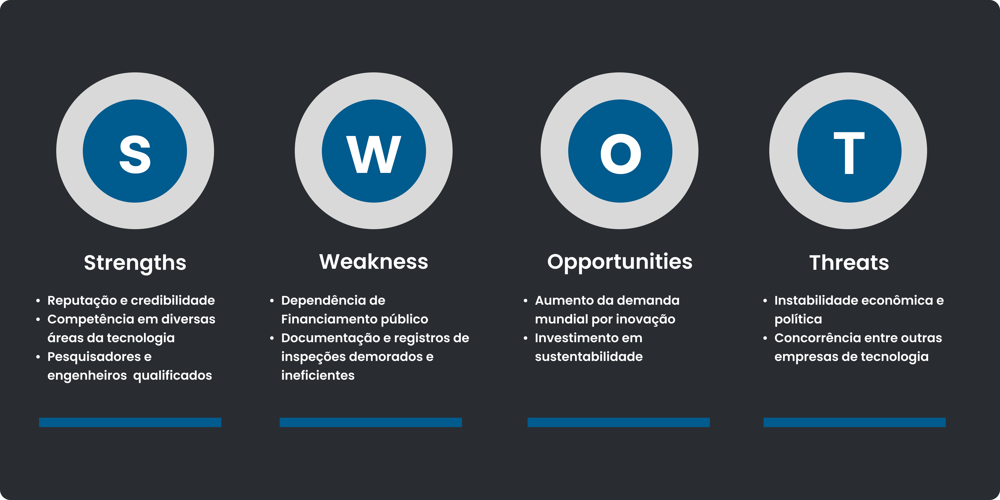

<div align="center">
</div>

<div align="center">
<sub>Fonte: autoria própria (2025)</sub>
</div>


#### **Strengths**

- **Reputação e credibilidade:** Muito tempo de atuação no mercado de tecnologia e inovação, com reconhecimento nacional e internacional.

- **Competência em diversas áreas da tecnologia:** O IPT atua em diversas áreas do mercado tecnológico.

- **Pesquisadores e engenheiros qualificados:** Profissionais altamente especializados em diversas áreas do conhecimento.

#### **Weakness**

- **Dependência de financiamento público:** Pode ser afetado por cortes orçamentários ou políticas governamentais.

- **Documentação e registros de inspeções demorados e ineficientes:** Pode causar atrasos durante o registro das informações.

#### **Opportunities**

- **Aumento da demanda mundial por inovação:** Empresas e governos em busca de novas soluções e tecnologias para manter a competitividade dentro do mercado.

- **Investimento em sustentabilidade:** O IPT pode se tornar referência em pesquisas e soluções ambientais.

#### **Threats**

- **Instabilidade econômica e política:** Pode sofrer cortes e reduções em investimentos e pesquisas.

- **Concorrência entre outras empresas de tecnologia:** Empresas privadas podem oferecer soluções tecnológicas e serviços de forma mais eficiente.

### 2.1.3. Solução (sprints 1 a 5)

#### **1. Problema a ser resolvido**

Falta de aplicações de inspeções prediais, por causa da complexidade e diversidade das necessidades de cada edifício, que possuem características únicas. Além disso, a quantidade de dados e registros fotográficos é grande, dificultando a organização dos dados manualmente.

#### **2. Dados disponíveis**

A TAPI (Termo de Abertura do Projeto Inteli) está disponível para a execução do projeto, fornecendo informações essenciais sobre o problema, escopo, entregáveis e restrições. A TAPI foi elaborada em conjunto entre o **IPT** (Parceiro de projeto) e o **Inteli**.

#### **3. Solução proposta**

Aplicação web que permite o registro de textos e imagens da inspeção predial em um banco de dados, sendo capaz de gerar documentos técnicos para a exportação. A aplicação também viabiliza a consulta das informações a qualquer momento e por todo funcionário.

#### **4. Forma de utilização da solução**

A solução deve ser utilizada na _web_, podendo ser acessada tanto por meio de computadores quanto celulares. O utilizador acessará a aplicação, e poderá colocar fotos com descrições, acessar registros do banco de dados e exportar relatórios com as informações desejadas.

#### **5. Benefícios esperados**

Maior flexibilidade para a realização de inspeções prediais, facilitando o fluxo de trabalho dos engenheiros. Também é esperado a substituição de meios materiais para o registro, centralizando as informações necessárias para o registro das inspeções, além de permitir de forma rápida e eficiente a consulta dos dados.

#### **6. Critério de sucesso e como será avaliado**

A aplicação será bem-sucedida se ela for capaz de substituir o método atual de registro das informações provenientes da inspeção. Isso pode ser avaliado por meio de testes com o público-alvo, indicando se os recursos correspondem com as expectativas do projeto.

### 2.1.4. Value Proposition Canvas (sprint 1):

O **Canvas de Proposta de Valor** é uma ferramenta desenvolvida para a criação de benefícios para o consumidor. Ele foi elaborado por _Alex Osterwalder_, no livro _Value Proposition Design: How to Create Products and Services Customers_ want. O material é dividido em duas partes: o **perfil do consumidor** e o **mapa de valor**.

O **perfil do consumidor** busca analisar as características essenciais do consumidor do produto. Ele é dividido em três seções: **tarefas**, **dores** e **ganhos**. As tarefas descrevem aquilo que os consumidores buscam realizar na sua vida e trabalho. Já as dores são os **riscos e obstáculos** para a execução das atividades. Por fim, os ganhos registram os **benefícios** que os clientes buscam.

O **mapa de valor** é preenchido com base no perfil do consumidor levantado. Ele também é segmentado em três partes, sendo elas: **produto e serviço**, **analgésicos** e **criadores de ganho**. O produto e serviço é a **solução** desenvolvida para o cliente, seguindo aquilo que foi estabelecido anteriormente. Os analgésicos são como o produto e serviço buscam **aliviar as dores** sentidas pelo consumidor. Por último, os criadores de ganho seguem a mesma lógica, registrando como a solução traz **benefícios** para o usuário.

Sob esse viés, elaboramos o **Canvas de Proposta de Valor** do nosso projeto, podendo ser visto à seguir:

<div align="center">
<sub>Figura 3 - Value Proposition Canvas </sub>

</div>

<div>
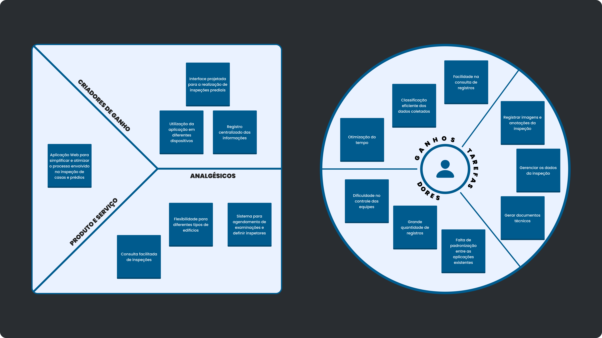

<div align="center">
</div>

<div align="center">
<sub>Fonte: autoria própria (2025)</sub>
</div>


#### **Perfil do consumidor**

Nesse contexto, o Canvas é direcionado para a área de **inspeção predial na construção civil**, de acordo com o projeto. O **perfil do consumidor** reflete essa escolha, anotando tarefas comuns, como a captura de imagens referentes aos dados coletados e o gerenciamento de documentos técnicos.

No entanto, a execução desses procedimentos é afetada por problemas, conforme a seção “dores”. Esses obstáculos são variados, como a grande quantidade de registros necessários durante uma inspeção, que tradicionalmente são feitos com papel e caneta. Por outro lado, a **falta de padronização** entre as opções existentes do mercado inviabiliza a utilização de um sistema digital.

Seguindo esse caminho, os ganhos indicados buscam representar aquilo que um engenheiro de inspeções deseja para a execução de seu trabalho, de forma a afastar-se das dores.

#### **Mapa de valor**

Conforme estabelecido por _Osterwalder_ (2014), utilizou-se o perfil do consumidor para estabelecer um **mapa de valor**, de forma a explicitar o modelo de negócios definido.

O produto a ser desenvolvido é uma **aplicação web**, com o objetivo de **facilitar** o processo de inspeção predial. Essa decisão foi tomada com base no entendimento do negócio, visando mitigar as dores analisadas no Canvas.

Além disso, os criadores de ganho também apresentam os **benefícios** da solução proposta que elevam o seu valor para o consumidor, como o registro centralizado de informações, por exemplo.

### 2.1.5. Matriz de Riscos do Projeto (sprint 1)

A Matriz de Riscos, também conhecida como Matriz de Probabilidade e Impacto, é uma ferramenta essencial para o gerenciamento de riscos, permitindo identificar visualmente quais ameaças exigem maior atenção. Como um instrumento de priorização, essa matriz é amplamente utilizada na fase de **avaliação de riscos**, ajudando a equipe a tomar decisões estratégicas sobre mitigação e prevenção.

Para entender a aplicação da matriz, é fundamental compreender o conceito de **risco**, que resulta da interação entre a probabilidade de um evento ocorrer e o impacto de suas consequências. Quanto maior a chance de um risco se concretizar e mais severos forem seus efeitos, maior a prioridade que ele deve receber.

O quadro abaixo detalha as **probabilidades** e as **categorias de impacto** associadas a cada evento, proporcionando uma visão clara dos riscos que podem afetar o projeto e auxiliando na formulação de estratégias eficazes de mitigação.

<div align="center">
<sub>Quadro 1 - Probabilidade</sub>

| Probabilidade | Descrição dos critérios de Probabilidade             |
| ------------- | ---------------------------------------------------- |
| 10%           | Não é provável que aconteça                          |
| 30%           | Pode ser que ocorra uma vez dentro de um ano         |
| 50%           | Pode ser que ocorra mais de uma vez dentro de um ano |
| 70%           | Pode ser que ocorra mensalmente                      |
| 90%           | Pode ser que ocorra semanalmente                     |

<sup>Fonte: Bianca Minetto Napoleão, 2019.</sup>

</div>

<div align="center">
<sub>Quadro 2 - Impacto</sub>

| Impacto     | Descrição dos critérios de Impacto                                                                 |
| ----------- | -------------------------------------------------------------------------------------------------- |
| Muito baixo | Os riscos possuem consequências pouco significativas                                               |
| Baixo       | Os riscos possuem consequências reversíveis em curto e médio prazo com custos pouco significativos |
| Moderado    | Os riscos possuem consequências reversíveis em curto e médio prazo com custos baixos               |
| Alto        | Os riscos possuem consequências reversíveis em curto e médio prazo com custos altos                |
| Muito Alto  | Os riscos possuem consequências irreversíveis ou com custos inviáveis                              |

<sup>Fonte: Bianca Minetto Napoleão, 2019.</sup>

</div>

A partir dos conceitos estabelecidos, o grupo desenvolveu uma Matriz de Risco alinhada com o nosso projeto.


## Matriz de Riscos e Oportunidades – Aplicação Web de Inspeção Predial

### Ameaças e Planos de Ação


<div align="center">
<sub>Figura 4 - Ameaças </sub>

</div>

<div>

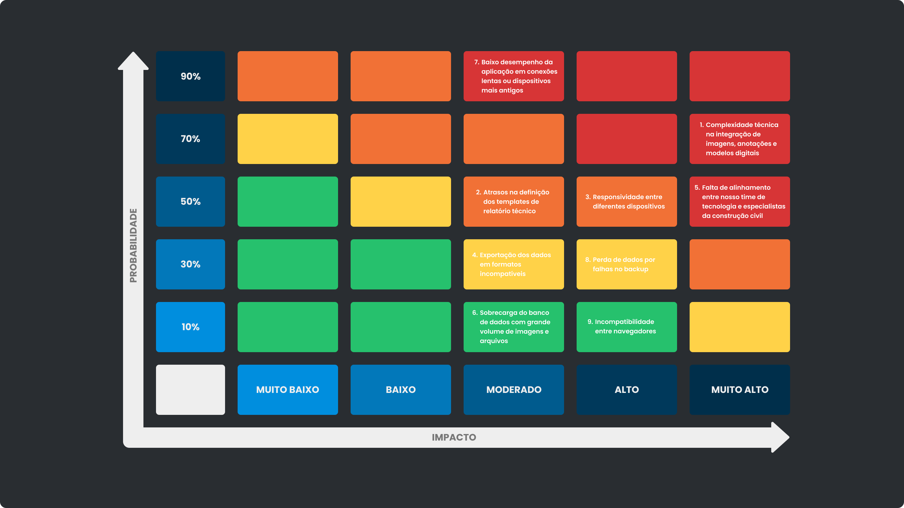

<div align="center">
</div>

<div align="center">
<sub>Fonte: autoria própria (2025)</sub>
</div>

---

### Risco 1: Complexidade técnica na integração de imagens, anotações e modelos digitais  
**Probabilidade**: Alta  
**Impacto**: Muito Alto  
**Mitigação**: Utilizar bibliotecas especializadas, adotar arquitetura modular e realizar testes com MVP para validar a solução.

---

### Risco 2: Atrasos na definição dos templates de relatório técnico  
**Probabilidade**: Média  
**Impacto**: Médio  
**Mitigação**: Realizar workshops com especialistas e validar templates em ciclos curtos com stakeholders.

---

### Risco 3: Responsividade entre diferentes dispositivos  
**Probabilidade**: Média  
**Impacto**: Alto  
**Mitigação**: Aplicar técnicas de design responsivo desde o início e testar a aplicação em múltiplas resoluções e navegadores.

---

### Risco 4: Problemas na exportação dos dados em formatos compatíveis  
**Probabilidade**: Baixa  
**Impacto**: Médio  
**Mitigação**: Utilizar bibliotecas consolidadas de exportação e definir desde o início os formatos exigidos pelos usuários finais.

---

### Risco 5: Falta de alinhamento entre nosso time de tecnologia e especialistas da construção civil  
**Probabilidade**: Média  
**Impacto**: Muito Alto  
**Mitigação**: Criar rituais de alinhamento quinzenais, glossários técnicos compartilhados e design participativo durante o desenvolvimento.

---

### Risco 6: Sobrecarga do banco de dados com grande volume de imagens e arquivos  
**Probabilidade**: Muito Baixa  
**Impacto**: Médio  
**Mitigação**: Usar serviços de armazenamento em nuvem, compressão de imagens e lazy loading para otimizar recursos.

---

### Risco 7: Baixo desempenho da aplicação em conexões lentas ou dispositivos mais antigos  
**Probabilidade**: Alta  
**Impacto**: Médio  
**Mitigação**: Otimizar os scripts e imagens, realizar testes de desempenho e incluir fallback para versões leves da aplicação.

---

### Risco 8: Perda de dados por falhas no backup  
**Probabilidade**: Baixa  
**Impacto**: Alto  
**Mitigação**: Implementar backups automáticos e redundância de dados em servidores distintos.

---

### Risco 9: Problemas de compatibilidade entre navegadores  
**Probabilidade**: Muito Baixa  
**Impacto**: Alto  
**Mitigação**: Adotar padrões web e realizar testes com os principais navegadores (Chrome, Firefox, Safari, Edge).

---

### Risco 10: Indisponibilidade do banco de dados  
**Probabilidade**: baixa  
**Impacto**: Muito Alto  
**Mitigação**: Utilizar serviços de banco de dados escaláveis com failover, monitoramento em tempo real e alertas automatizados.

---

## Priorização dos Riscos (Índice de Risco = Probabilidade x Impacto)

<div align="center">
<sub>Quadro 3 - Priorização dos riscos</sub>

| Risco | Probabilidade (1-5) | Impacto (1-5) | Índice de Risco |
|-------|----------------------|---------------|------------------|
| Risco 1 | 4 | 5 | 20 |
| Risco 5 | 3 | 5 | 15 |
| Risco 3 | 3 | 4 | 12 |
| Risco 7 | 4 | 3 | 12 |
| Risco 10 | 2 | 5 | 10 |
| Risco 2 | 3 | 3 | 9 |
| Risco 8 | 2 | 4 | 8 |
| Risco 4 | 2 | 3 | 6 |
| Risco 9 | 1 | 4 | 4 |
| Risco 6 | 1 | 3 | 3 |

<sup>Fonte: autoria própria (2025)</sup>

</div>

---

### Interdependência dos Riscos

- **Risco 1** pode impactar diretamente o desempenho da aplicação (Risco 7) e sobrecarregar o banco de dados (Risco 6).
- **Risco 5** pode causar atrasos na definição dos templates (Risco 2).
- **Risco 10** pode ser agravado pela sobrecarga de dados (Risco 6) ou problemas de exportação (Risco 4).

---

### Oportunidades e Planos de Ação

<div align="center">
<sub>Figura 5 - Oportunidades </sub>

</div>

<div>

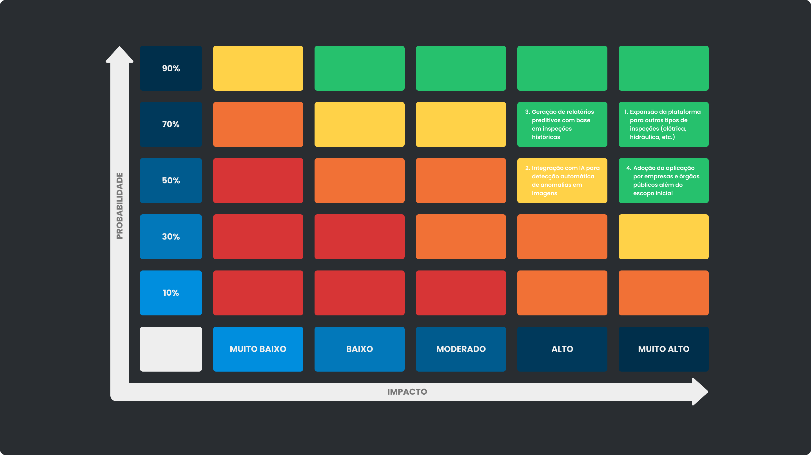

<div align="center">
</div>

<div align="center">
<sub>Fonte: autoria própria (2025)</sub>
</div>

---

### Oportunidade 1: Expansão da plataforma para outros tipos de inspeções (elétrica, hidráulica, etc.)  
**Probabilidade**: Alta  
**Impacto**: Muito Alto  
**Aproveitamento**: Modularizar a arquitetura para permitir adaptação do sistema a diferentes escopos técnicos com rapidez.

---

### Oportunidade 2: Integração com IA para detecção automática de anomalias em imagens  
**Probabilidade**: Média  
**Impacto**: Alto  
**Aproveitamento**: Incluir modelo treinado com banco de dados técnico para sugerir falhas estruturais automaticamente.

---

### Oportunidade 3: Geração de relatórios preditivos com base em inspeções históricas  
**Probabilidade**: Alta  
**Impacto**: Alto  
**Aproveitamento**: Utilizar aprendizado de máquina para prever deteriorações com base em padrões anteriores.

---

### Oportunidade 04. Adoção da aplicação por empresas e órgãos públicos além do escopo inicial  
**Probabilidade:** Médio  
**Impacto:** Muito Alto  
**Aproveitamento:** A aplicação pode ser adaptada para inspeções e relatórios técnicos em diversos contextos, como prefeituras, órgãos reguladores e empresas privadas, ampliando significativamente o mercado-alvo e a escalabilidade do produto.

---

## 2.2. Personas (sprint 1)

**As personas são descrições fictícias**, porém realistas, que representam os usuários típicos ou o público-alvo de um produto. Elas são uma ferramenta essencial para orientar o direcionamento de projetos, transmitindo a essência dos usuários e garantindo o alinhamento da equipe durante todo o processo de desenvolvimento. (Nielsen Norman Group, 2025)

Ademais, na aplicação web, as personas cumprem um papel estratégico, ajudam a definir jornadas de usuário e a projetar funcionalidades específicas que atendam de forma mais precisa às necessidades e expectativas do público. Diante disso, a **equipe Clouding** desenvolveu personas para assegurar o alinhamento entre os usuários, a equipe de desenvolvimento e o modelo de gestão do IPT.

A aplicação web contará com um sistema de perfis fundamentado nessas personas. Entre elas, destacam-se: Roberto Rocha, que representa o perfil de administrador, Carolina Cunha, que simboliza o papel da coordenadora e Julio Gonçalves, que atua como inspetor da equipe. Dessa forma, a aplicação web será desenvolvida em um modo de navegação pensada nas necessidades específicas, promovendo uma experiência mais eficiente, intuitiva e alinhada ao contexto real de uso.

<br>
<div align="center">
<sub>Figura 6 - Persona 1 </sub>
</div>
<div>

<div align="center">
</div>

<div align="center">
<sub>Fonte: autoria própria (2025)</sub>
</div>


<br>
<div align="center">
<sub>Figura 7 - Persona 2 </sub>
</div>
<div>
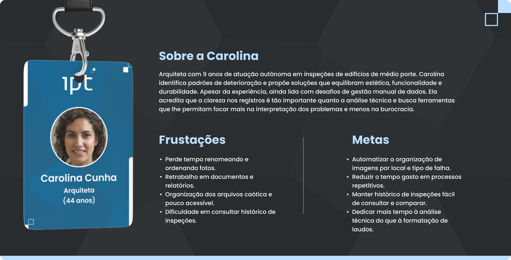
<div align="center">
</div>

<div align="center">
<sub>Fonte: autoria própria (2025)</sub>
</div>


<br>
<div align="center">
<sub>Figura 8 - Persona 3 </sub>
</div>
<div>

<div align="center">
</div>

<div align="center">
<sub>Fonte: autoria própria (2025)</sub>
<br> </br>
</div>


As personas refletem a diversidade de perfis envolvidos nas inspeções prediais, abrangendo profissionais que atuam como administradores, coordenadores e membros de equipe técnica. Apesar das diferenças em experiência e familiaridade com tecnologia, compartilham necessidades e dores recorrentes, como retrabalho, desorganização e processos manuais, além de metas comuns voltadas à otimização do tempo e ao ganho de eficiência. 

Com isso, para atender a esses desafios, a aplicação web proposta foi concebida com foco em usabilidade intuitiva, padronização de fluxos e suporte à digitalização. Assim, as personas desempenham um papel essencial no alinhamento da solução com a realidade do setor, promovendo a modernização dos processos e preservando a simplicidade de uso.

## 2.3. User Stories (sprints 1 a 5)

User Stories são utilizadas para descrever funcionalidades de um produto ou serviço de maneira simples, comunicando a visão do cliente e como ela deve ser desenvolvida. Esses recursos devem ser detalhados por meio de critérios de aceite, que especificam como devem ser testados e implementados, além de quais condições devem ser atendidas para que sejam aceitas.

Os critérios INVEST são utilizados para avaliar a qualidade de uma User Story. As características que devem ser consideradas são: Independente, Negociável, Valiosa, Estimável, Pequena (Small) e Testável. Essas etapas são essenciais para garantir que as expectativas do cliente sejam atendidas.

<div align="center">
<sub>Quadro 4 - User Story 1</sub>

Identificação | US01 
--- | ---
Persona | Roberto
User Story | “Como administrador, posso ter acesso a todos os relatórios e fotos, para monitorar o desempenho dos funcionários.”
Critério de aceite 1 | Ao clicar no botão “inspeções”, deverá aparecer uma lista com todas as inspeções registradas.
Critério de aceite 2 | Ao selecionar a inspeção desejada, uma lista com os relatórios e fotos referentes deverá ser mostrada.
Critérios INVEST | **Independente**: A funcionalidade de visualização de relatórios e fotos pode ser adicionada de forma isolada, desde que já exista um sistema de armazenamento desses dados.  <br>**Negociável**: Os critérios de exibição (filtros e formato) podem ser ajustados conforme necessidade, sem impactar o núcleo da funcionalidade.  <br>**Valiosa**: Oferece ao administrador uma forma eficiente de acompanhar o desempenho dos funcionários por meio de dados (relatórios e fotos).<br>**Estimável**: O esforço para implementação pode ser calculado com base na complexidade da interface e na integração com o banco de dados. <br>**Pequena**: A funcionalidade pode ser desenvolvida em uma sprint, considerando que o sistema de armazenamento já esteja disponível. <br>**Testável**: Pode ser verificado se a lista de inspeções é exibida corretamente e se os relatórios e fotos são carregados ao selecionar uma inspeção.

<sup>Fonte: Fonte: autoria própria (2025)</sup>

</div>

<div align="center">
<sub>Quadro 5 - User Story 2</sub>

Identificação | US02
--- | ---
Persona | Carolina
User Story | “Como coordenadora, posso filtrar os funcionários disponíveis para selecionar aquele com o perfil mais similar para a inspeção desejada.”
Critério de aceite 1 | Ao clicar no botão “nova inspeção”, deverá aparecer uma tela para designar funcionários.
Critério de aceite 2 | Na tela de designar funcionários, ao clicar no botão “filtros”, aparecerá uma lista de características, como formação e disponibilidade.
Critério de aceite 3 | Ao selecionar um usuário, ele será adicionado para a inspeção na base de dados.
Critérios INVEST | **Independente**: A funcionalidade pode ser desenvolvida isoladamente, assumindo que já exista um cadastro de funcionários com seus perfis e um sistema básico de agendamento de inspeções.<br>**Negociável**: Os Aspectos que podem ser ajustados são, quais campos de filtro serão incluídos (formação, disponibilidade, especialização, etc.), Como os filtros serão apresentados (dropdowns, checkboxes, busca) e o processo de seleção e atribuição do funcionário.<br>**Valiosa**: Oferece valor claro, otimiza o trabalho da coordenadora ao encontrar o profissional mais adequado, aumentando a eficiência do processo de inspeção e melhora a qualidade das inspeções ao alocar os melhores perfis.<br>**Estimável**: O esforço pode ser estimado considerando o desenvolvimento da interface de filtragem, lógica de busca e filtragem no backend, Integração com o sistema existente de funcionários e inspeções e os Testes das funcionalidades.<br>**Pequena**: Criar interface básica para designar funcionários, implementar sistema de filtros e adicionar lógica de seleção e atribuição.<br>**Testável**: Pode ser testada através da verificação se os filtros retornam os funcionários corretos,  teste do processo de seleção e atribuição, validação se a atribuição foi registrada no banco de dados e testes de usabilidade da interface de filtragem.

<sup>Fonte: autoria própria (2025)</sup>

</div>


<div align="center">
<sub>Quadro 6 - User Story 3</sub>

Identificação | US03
--- | ---
Persona | Carolina
User Story | “Como coordenadora, posso agendar futuras inspeções prediais para manter o sistema atualizado.”
Critério de aceite 1 | No dashboard, ao clicar no botão: “nova inspeção”, o usuário deverá poder informar data, hora, local de inspeção e tipo de edifício nas respectivas caixas de texto.
Critério de aceite 2 | Quando uma nova inspeção for criada, ela deverá aparecer no banco de dados e ser atualizada no dashboard.
Critérios INVEST | **Independente**: A funcionalidade de agendamento pode ser implementada de forma isolada, desde que exista um sistema básico de cadastro e um banco de dados para armazenar as inspeções.<br>**Negociável**: O formato de exibição no dashboard (lista, calendário, cards) pode ser mudado posteriormente. <br>**Valiosa**: Permite que a coordenadora mantenha o controle das inspeções prediais, evitando falhas no planejamento e garantindo que o sistema esteja atualizado.<br>**Estimável**: O esforço de implementação pode ser calculado com base na complexidade do formulário, na integração com o banco de dados e na atualização em tempo real do dashboard. Exemplo: 3-5 dias de desenvolvimento (front-end + back-end).<br>**Pequena**: Pode ser desenvolvida em um único sprint (1-2 semanas), desde que a infraestrutura básica (banco de dados, dashboard) já esteja disponível.<br>**Testável**: Pode ser verificado se o botão "nova inspeção" abre o formulário corretamente, se os dados são salvos no banco de dados após o preenchimento e se a inspeção agendada aparece no dashboard imediatamente.

<sup>Fonte: autoria própria (2025)</sup>

</div>

<div align="center">
<sub>Quadro 7 - User Story 4</sub>

Identificação | US04
--- | ---
Persona | Júlio
User Story | “Como inspetor, posso ver os detalhes da inspeção (endereço, tipo de imóvel e data), para saber exatamente onde e o que devo inspecionar.”
Critério de aceite 1 | Ao entrar no dashboard, uma lista com as inspeções disponíveis para o usuário deverá aparecer, classificadas de acordo com o status de cada uma.
Critério de aceite 2 | Ao selecionar uma das inspeções disponíveis, deverá ser mostrado uma tela com os dados técnicos referentes à inspeção.
Critérios INVEST | **Independente**: Esta funcionalidade pode ser desenvolvida isoladamente, assumindo que já existe um sistema de cadastro de inspeções e há um dashboard básico implementado. Não depende de outras features complexas para funcionar.<br>**Negociável**: Aspectos podem ser ajustados são, quais dados técnicos serão mostrados, como a lista será classificada (por status, data, prioridade) e o layout da tela de detalhes pode ser refinado.<br>**Valiosa**: Oferece valor claro e fundamental para o trabalho do inspetor (Júlio). Garante que ele tenha todas as informações necessárias para a inspeção e evita erros e retrabalhos por falta de informação.<br>**Estimável**: Pode ser bem estimado:<br>Frontend: Listagem e tela de detalhes (~2-3 dias)<br>Backend: Consulta dos dados (1-2 dias)<br>Testes: 1 dia<br>Total estimado: 4-6 dias de trabalho<br>**Pequena**: Perfeitamente implementável em um sprint, o escopo bem definido e limitado, não requer integrações complexas e pode ser desenvolvido em menos de uma semana.<br>**Testável**: Tudo pode ser facilmente testável através de Testes manuais. Como verificar se a lista aparece corretamente e confirmar se os detalhes são exibidos ao selecionar uma inspeção. Testes automatizados também nos ajudaram em validar a consulta dos dados e a verificar a classificação por status.

<sup>Fonte: autoria própria (2025)</sup>

</div>

<div align="center">
<sub>Quadro 8 - User Story 5</sub>

Identificação | US05
--- | ---
Persona | Júlio
User Story | “Como inspetor, posso tirar fotos durante a inspeção e anexá-las aos itens inspecionados, para tornar a descrição mais completa.”
Critério de aceite 1 | Ao entrar no dashboard, uma lista com as inspeções disponíveis para o usuário deverá aparecer, classificadas de acordo com o status de cada uma.
Critério de aceite 2 | Ao selecionar uma das inspeções disponíveis que ainda esteja em andamento, o usuário poderá anexar uma foto.
Critério de aceite 3 | Ao anexar uma foto, o inspetor será capaz de escrever uma legenda para clarificar a informação.
Critérios INVEST | **Independente**: Pode ser desenvolvida isoladamente desde que exista um sistema básico de listagem de inspeções e Infraestrutura para upload e armazenamento de imagens. Não depender de outras funcionalidades como geração de relatórios ou sistemas de aprovação. <br>**Negociável**: Os seguintes aspectos podem ser ajustados sem impactar o núcleo, Limite de fotos por item inspecionado, Formato/tamanho das imagens aceitas, Obrigatoriedade da legenda, Forma de exibição das fotos (galeria, miniaturas, etc.).<br>**Valiosa**: Oferece benefícios tangíveis, Aumenta a precisão e confiança das inspeções com uma evidência visual, reduz confusões na documentação, facilita a comunicação entre campo e escritório e diminui a necessidade de revisitas ao local. <br>**Estimável**: Esforço pode ser calculado como o Front-end (interface de upload e preview)irá durar 2 a 3 dias, Back-end (armazenamento e associação de imagens)terá 3 a 4 dias para ser elaborado e os testes e ajustes podem ser feitos em 1 ou 2 dias, somando um total de 6 a 9 dias. <br>**Pequena**: Escopo bem definido e limitado, Foca apenas no fluxo de captura e anexo de fotos, Não inclui edição avançada de imagens ou compartilhamento externo, Pode ser concluída em 1 sprint (2 semanas).<br>**Testável**: nossa  funcionalidade pode ser verificada através de testes manuais, upload a partir de diferentes fontes (câmera, galeria), validação de formatos de imagem, associação correta da foto ao item inspecionado, persistência das legendas. Os Testes automatizados podem dar validar o fluxo completo e os testes de carga para múltiplos uploads.

<sup>Fonte: autoria própria (2025)</sup>

</div>

<div align="center">
<sub>Quadro 9 - User Story 6</sub>

Identificação | US06
--- | ---
Persona | Roberto
User Story | “Como administrador, posso verificar todas as inspeções agendadas, para obter uma visão geral sobre o cronograma.”
Critério de aceite 1 | Ao clicar no botão “inspeções”, deverá aparecer uma lista com todas as inspeções registradas.
Critério de aceite 2 | Na lista de inspeções, elas deverão ser mostradas divididas com base no status.
Critério de aceite 3 | Ao clicar em uma inspeção em específico, deverá aparecer a data em que ela ocorrerá.

<sup>Fonte: autoria própria (2025)</sup>

</div>

<div align="center">
<sub>Quadro 10 - User Story 7</sub>

Identificação | US07
--- | ---
Persona | Carolina
User Story | Como coordenadora, posso acessar informações básicas da inspeção (local, inspetor e data) para facilitar a organização.”
Critério de aceite 1 | Ao entrar no dashboard, uma lista com as inspeções disponíveis para o usuário deverá aparecer, classificadas de acordo com o status de cada uma.
Critério de aceite 2 | Ao selecionar uma das inspeções disponíveis, deverá ser mostrado uma tela com os dados técnicos referentes à inspeção.

<sup>Fonte: autoria própria (2025)</sup>

</div>

<div align="center">
<sub>Quadro 11 - User Story 8</sub>

Identificação | US08
--- | ---
Persona | Carolina
User Story |  “Como coordenadora, posso verificar o andamento do processo de inspeção, para que ele ocorra sem problemas.”
Critério de aceite 1 | Ao entrar no dashboard, uma lista com as inspeções disponíveis para o usuário deverá aparecer, classificadas de acordo com o status de cada uma.
Critério de aceite 2 | Ao selecionar uma das inspeções disponíveis, deverá ser mostrada uma lista com todos os registros feitos.
Critério de aceite 3 | Ao clicar no botão: “filtrar” na aba de registros, aparecerá as tags registradas pelos inspetores, para que o usuário possa selecionar os registros desejados.

<sup>Fonte: autoria própria (2025)</sup>

</div>

<div align="center">
<sub>Quadro 12 - User Story 9</sub>

Identificação | US09
--- | ---
Persona | Júlio
User Story |  “Como inspetor, posso exportar os registros realizados durante a inspeção para facilitar a elaboração do relatório.”
Critério de aceite 1 | Ao entrar no dashboard, uma lista com as inspeções disponíveis para o usuário deverá aparecer, classificadas de acordo com o status de cada uma.
Critério de aceite 2 | Ao selecionar uma das inspeções disponíveis que já tenha sido finalizada, aparecerá o botão: “exportar dados”.
Critério de aceite 3 | Ao apertar o botão “exportar dados”, as informações presentes no banco de dados quanto aos registros das inspeções será apresentado no formato de arquivo desejado.

<sup>Fonte: autoria própria (2025)</sup>

</div>

<div align="center">
<sub>Quadro 13 - User Story 10</sub>

Identificação | US10
--- | ---
Persona | Júlio
User Story | “Como inspetor, posso adicionar marcadores nas fotos que eu tirei para facilitar a compreensão de todos”.
Critério de aceite 1 | Ao terminar de adicionar um registro de uma inspeção, o botão: “marcadores” ficará disponível.
Critério de aceite 2 | Ao apertar o botão: “marcadores”, o usuário poderá escolher a tag desejada de uma lista já definida, ou escrever o seu próprio.
Critério de aceite 3 | Após o marcador ter sido registrado, ele aparecerá para todos os usuários que consultarem o registro e/ou banco de dados.

<sup>Fonte: autoria própria (2025)</sup>

</div>

# <a name="c3"></a>3. Projeto da Aplicação Web (sprints 1 a 4)

## 3.1. Arquitetura (sprints 3 e 4)

A aplicação web de inspeções prediais foi desenvolvida seguindo o padrão arquitetural **Model-View-Controller (MVC)**, uma abordagem que promove a separação clara de responsabilidades e facilita a manutenção e escalabilidade do sistema. Esta arquitetura organiza o código em três camadas distintas e interconectadas, cada uma com funções específicas no processamento de requisições e apresentação de dados.

### Visão Geral da Arquitetura MVC

O padrão MVC divide a aplicação em três componentes principais:

- **Model (Modelo)**: Responsável pela lógica de dados, regras de negócio e comunicação com o banco de dados
- **View (Visão)**: Camada de apresentação que renderiza a interface do usuário e gerencia a interação visual
- **Controller (Controlador)**: Intermediário que processa requisições, coordena a comunicação entre Model e View, e implementa a lógica de aplicação

Esta separação permite que cada camada evolua independentemente, facilita a testabilidade do código e promove a reutilização de componentes. No contexto da aplicação de inspeções prediais, essa organização é especialmente importante devido à complexidade dos fluxos de trabalho e à diversidade de perfis de usuários (administradores, coordenadores e inspetores).

### Fluxo de Requisição e Resposta

O fluxo de comunicação na arquitetura MVC da aplicação segue um padrão bem definido:

1. **Requisição do Usuário**: O usuário interage com elementos da interface (botões, formulários, links) nas **Views**
2. **Roteamento**: O Express.js direciona a requisição HTTP para o **Controller** apropriado baseado na URL e método HTTP
3. **Processamento**: O **Controller** valida dados, implementa regras de negócio e aciona os **Models** necessários
4. **Acesso aos Dados**: Os **Models** executam operações no banco de dados PostgreSQL via conexão direta
5. **Preparação da Resposta**: O **Controller** organiza os dados retornados pelos **Models**
6. **Renderização**: A **View** correspondente é renderizada com os dados processados usando EJS
7. **Resposta ao Cliente**: A página HTML final é enviada ao navegador do usuário

### Tecnologias e Ferramentas

A implementação da arquitetura MVC utiliza as seguintes tecnologias:

**Backend:**
- **Node.js**: Runtime JavaScript para execução do servidor
- **Express.js**: Framework web para roteamento e middleware
- **EJS (Embedded JavaScript)**: Engine de template para renderização dinâmica das Views
- **PostgreSQL**: Sistema de gerenciamento de banco de dados relacional com conexão direta via pg

**Frontend:**
- **HTML**: Estruturação semântica das páginas
- **CSS**: Estilização responsiva e design visual customizado
- **JavaScript**: Interatividade do lado cliente e comunicação assíncrona
- **Chart.js**: Biblioteca para visualização de dados em gráficos

**Infraestrutura:**
- **Express-session**: Gerenciamento de sessões de usuário
- **Multer**: Middleware para upload de arquivos (imagens das inspeções)
- **dotenv**: Gerenciamento de variáveis de ambiente

<div align="center">
<sub>Figura 9 - Diagrama MVC</sub>
<br>
</div>
<div>
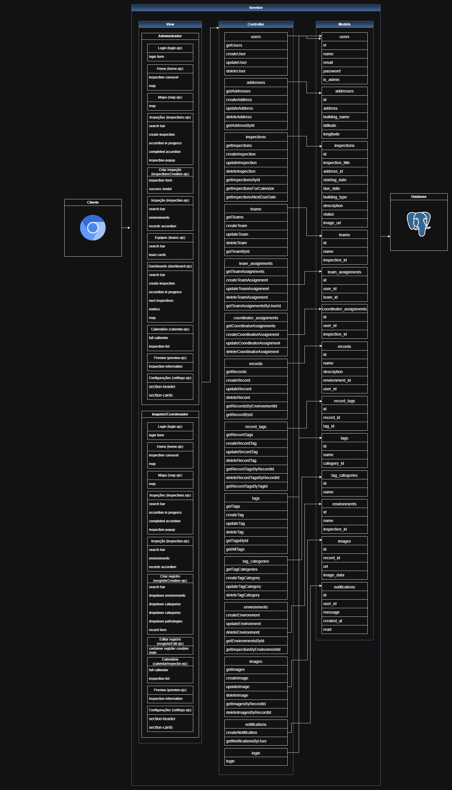
<div align="center">
</div>

Para visualizar o diagrama UML detalhado dos componentes internos e suas relações, acesse o arquivo disponível em:

[Diagrama UML detalhado (Draw.io)](https://drive.google.com/file/d/1_h342M5mOdq-XihyA7CzxUuDJA68tMTU/view?usp=sharing)

O diagrama apresenta os módulos de Models, Views e Controllers, bem como as interações entre eles, detalhando a estrutura interna do sistema.

### Controllers (Controladores)

Os **Controllers** constituem a camada intermediária da arquitetura MVC, responsável por orquestrar a comunicação entre as **Views** e os **Models**. Na aplicação de inspeções prediais, cada controller é especializado em um domínio específico do sistema, garantindo organização e manutenibilidade do código.

**Responsabilidades dos Controllers:**
- Receber e validar requisições HTTP das Views
- Implementar regras de negócio e lógica de aplicação
- Coordenar chamadas aos Models para operações de dados
- Preparar dados para renderização nas Views
- Gerenciar fluxos de autenticação e autorização
- Tratar erros e exceções de forma consistente

**Estrutura Organizacional:**
Os controllers estão organizados por funcionalidade, seguindo o princípio de responsabilidade única. Cada controller gerencia um conjunto específico de operações relacionadas a uma entidade ou processo do sistema.

**Padrões de Implementação dos Controllers:**

Todos os controllers seguem padrões consistentes de implementação:
- **Validação de entrada**: Verificação de dados recebidos das Views antes do processamento
- **Tratamento de erros**: Captura e tratamento adequado de exceções com respostas apropriadas
- **Autorização**: Verificação de permissões baseada no perfil do usuário autenticado
- **Formatação de resposta**: Preparação de dados no formato adequado para renderização nas Views
- **Logging**: Registro de operações importantes para auditoria e debugging

#### **usersController (Controlador de Usuários)**  
Responsável por gerenciar as operações relacionadas aos usuários no sistema. Atua em conjunto com o modelo de usuários para listar, cadastrar, atualizar e remover registros.

- **getUsers()**: Recupera todos os usuários cadastrados no sistema.  
- **createUser()**: Realiza o cadastro de um novo usuário, exigindo os campos `name`, `email`, `password` e `is_admin`.  
- **updateUser()**: Atualiza um usuário existente, requerendo o `id` do usuário, além dos campos `name`, `email`, `password` e `is_admin`.  
- **deleteUser()**: Remove um usuário do sistema a partir do `id` fornecido.

#### **addressController (Controlador de Endereços)**  
Responsável por gerenciar as operações relacionadas aos endereços no sistema. Atua em conjunto com o serviço de endereços para listar, cadastrar, atualizar e remover registros.

- **getAddresses()**: Recupera todos os endereços cadastrados no sistema.  
- **createAddress()**: Realiza o cadastro de um novo endereço, exigindo os campos `address`, `building_name`, `latitude` e `longitude`.  
- **updateAddress()**: Atualiza as informações de um endereço existente, requerendo o `id` do endereço, além dos campos `address`, `building_name`, `latitude` e `longitude`.  
- **deleteAddress()**: Remove um endereço do sistema a partir do `id` fornecido.  
- **getAddressById()**: Retorna os dados de um endereço específico com base no seu `id`.

#### **inspectionsController (Controlador de Inspeções)**  
Responsável por gerenciar as operações relacionadas às inspeções no sistema. Trabalha com o serviço de inspeções para listar, cadastrar, atualizar e remover registros.

- **getInspections()**: Recupera todas as inspeções cadastradas no sistema.  
- **createInspection()**: Realiza o cadastro de uma nova inspeção, exigindo os campos: `inspection_title`, `address_id`, `starting_date`, `due_date`, `building_type`, `description`, `status` e `image_url`.  
- **updateInspection()**: Atualiza uma inspeção existente, requerendo o `id` da inspeção e os campos atualizados.  
- **deleteInspection()**: Remove uma inspeção do sistema a partir do `id` fornecido.  
- **getInspectionsById()**: Retorna uma inspeção específica com base no seu `id`.  
- **getInspectionsForCalendar()**: Retorna as inspeções formatadas para visualização em um calendário.  
- **getInspectionsNextDueDate()**: Retorna as próximas inspeções com data de vencimento próxima.

#### **teamsController (Controlador de Equipes)**  
Responsável por gerenciar as operações relacionadas às equipes no sistema.

- **getTeams()**: Lista todas as equipes cadastradas.  
- **createTeam()**: Cadastra uma nova equipe, exigindo os campos `name` e `inspection_id`.  
- **updateTeam()**: Atualiza os dados de uma equipe com base no seu `id`.  
- **deleteTeam()**: Remove uma equipe existente.  
- **getTeamById()**: Retorna os dados de uma equipe específica pelo seu `id`.

#### **teamAssignmentsController (Controlador de Atribuições de Equipe)**  
Gerencia os vínculos entre usuários e equipes específicas.

- **getTeamAssignments()**: Lista todas as atribuições entre usuários e equipes.  
- **createTeamAssignment()**: Cria uma nova atribuição de usuário a uma equipe.  
- **updateTeamAssignment()**: Atualiza os dados de uma atribuição específica.  
- **deleteTeamAssignment()**: Remove uma atribuição existente.  
- **getTeamAssignmentsByUserId()**: Retorna todas as equipes às quais um usuário está vinculado.

#### **coordinatorAssignmentsController (Controlador de Atribuições de Coordenadores)**  
Gerencia a relação entre usuários coordenadores e inspeções.

- **getCoordinatorAssignments()**: Lista todas as atribuições de coordenadores.  
- **createCoordinatorAssignment()**: Cria uma nova atribuição de coordenador para uma inspeção.  
- **updateCoordinatorAssignment()**: Atualiza uma atribuição existente.  
- **deleteCoordinatorAssignment()**: Remove uma atribuição de coordenador.

#### **recordController (Controlador de Registros)**  
Gerencia os registros feitos dentro dos ambientes.

- **getRecords()**: Lista todos os registros existentes.  
- **createRecord()**: Cria um novo registro, exigindo os campos `name`, `description`, `environment_id` e `user_id`.  
- **updateRecord()**: Atualiza um registro existente.  
- **deleteRecord()**: Remove um registro específico.  
- **getRecordsByEnvironmentId()**: Retorna todos os registros de um determinado ambiente.  
- **getRecordByTagId()**: Retorna os registros que possuem uma determinada tag.

#### **recordTagsController (Controlador de Registros de Tags)**  
Responsável por gerenciar as relações entre registros e tags.

- **getRecordTags()**: Lista todos os vínculos entre registros e tags.  
- **createRecordTag()**: Cria uma nova associação entre um registro e uma tag.  
- **updateRecordTag()**: Atualiza a associação existente.  
- **deleteRecordTag()**: Remove uma associação.  
- **getRecordTagsByRecordId()**: Retorna todas as tags vinculadas a um determinado registro.  
- **deleteRecordTagsByRecordId()**: Remove todas as tags associadas a um registro.  
- **getRecordTagsByTagId()**: Retorna todos os registros que possuem determinada tag.

#### **tagsController (Controlador de Tags)**  
Responsável por gerenciar as tags cadastradas no sistema.

- **getTags()**: Lista todas as tags, com opção de filtro por `category_id`.  
- **createTag()**: Cadastra uma nova tag.  
- **updateTag()**: Atualiza os dados de uma tag existente.  
- **deleteTag()**: Remove uma tag pelo `id`.  
- **getTagsById()**: Retorna os dados de uma tag específica.  
- **getAllTags()**: Lista todas as tags disponíveis.

#### **tagCategoriesController (Controlador de Categorias de Tags)**  
Gerencia as categorias em que as tags podem ser agrupadas.

- **getTagCategories()**: Lista todas as categorias de tags.  
- **createTagCategory()**: Cadastra uma nova categoria.  
- **updateTagCategory()**: Atualiza os dados de uma categoria.  
- **deleteTagCategory()**: Remove uma categoria pelo `id`.

#### **environmentsController (Controlador de Ambientes)**  
Gerencia os ambientes vinculados às inspeções.

- **createEnvironment()**: Cria um novo ambiente para uma inspeção.  
- **updateEnvironment()**: Atualiza os dados de um ambiente.  
- **deleteEnvironment()**: Remove um ambiente.  
- **getEnvironmentsById()**: Retorna os ambientes de uma inspeção específica.  
- **getInspectionsByEnvironmentId()**: Retorna a inspeção relacionada a um ambiente.

#### **imagesController (Controlador de Imagens)**  
Gerencia o armazenamento de imagens vinculadas a registros.

- **getImages()**: Lista todas as imagens.  
- **createImage()**: Cadastra uma nova imagem com `record_id` e `url`.  
- **updateImage()**: Atualiza uma imagem existente.  
- **deleteImage()**: Remove uma imagem.  
- **getImagesByRecordId()**: Retorna as imagens de um determinado registro.  
- **deleteImagesByRecordId()**: Remove todas as imagens vinculadas a um registro.

#### **loginController (Controlador de Login)**  
Gerencia o processo de autenticação de usuários.

- **login(req, res)**:  
  - Recebe `email` e `password` via `req.body`.  
  - Chama o método `login` do `loginModel` para validar as credenciais.  
  - Se o login for bem-sucedido:  
    - Define `req.session.authenticated = true`.  
    - Redireciona para `/`.  
  - Caso contrário:  
    - Redireciona para `/login?error=1`.


### Models (Modelos)

Os **Models** constituem a camada de dados da arquitetura MVC, responsável por toda interação com o banco de dados PostgreSQL e implementação das regras de negócio relacionadas à persistência. Esta camada abstrai a complexidade das operações de banco de dados e fornece uma interface consistente para os Controllers.

**Responsabilidades dos Models:**
- Definir estrutura e relacionamentos das entidades de dados
- Implementar operações CRUD (Create, Read, Update, Delete)
- Aplicar validações de integridade e regras de negócio
- Gerenciar relacionamentos entre entidades
- Otimizar consultas e performance de acesso aos dados
- Garantir consistência transacional em operações complexas

**Estrutura de Dados:**
O sistema utiliza um modelo relacional bem estruturado que reflete os processos reais de inspeção predial. As principais entidades incluem usuários, inspeções, endereços, equipes, ambientes, registros, tags e imagens, todas interconectadas através de relacionamentos bem definidos.

**Principais Entidades do Sistema:**

#### **Entidades Principais**
- **Users**: Gerencia usuários (administradores, coordenadores, inspetores) com controle de perfis e autenticação
- **Inspections**: Núcleo central que representa cada inspeção predial com metadados completos
- **Addresses**: Localização geográfica das inspeções com coordenadas para mapeamento
- **Teams**: Organização de equipes de trabalho vinculadas a inspeções específicas
- **Environments**: Subdivisão de inspeções em ambientes específicos para organização detalhada

#### **Entidades de Relacionamento**
- **Team_Assignments**: Vincula usuários às equipes de trabalho
- **Coordinator_Assignments**: Define responsabilidades de coordenação por inspeção
- **Record_Tags**: Associa tags de classificação aos registros de patologias

#### **Entidades de Conteúdo**
- **Records**: Registros de patologias e observações feitas durante as inspeções
- **Images**: Evidências visuais associadas aos registros com metadados
- **Tags**: Sistema de classificação hierárquica para categorização de problemas
- **Tag_Categories**: Organização das tags em categorias para facilitar navegação

**Padrões de Implementação:**
- Uso de chaves primárias UUID para identificação única
- Relacionamentos bem definidos com integridade referencial
- Campos de auditoria (created_at, updated_at) para rastreabilidade
- Validações de dados no nível de aplicação e banco de dados
- Índices otimizados para consultas frequentes

Para uma descrição detalhada dos atributos e entidades dos Models utilizados, consulte a seção 3.5 deste documento.

### Views (Visões)

As **Views** representam a camada de apresentação da arquitetura MVC, responsável por renderizar a interface do usuário e gerenciar toda interação visual com o sistema. Na aplicação de inspeções prediais, as Views são implementadas usando **EJS (Embedded JavaScript)** como engine de template, permitindo renderização dinâmica de conteúdo baseado nos dados fornecidos pelos Controllers.

**Características das Views:**
- **Renderização Dinâmica**: Uso de EJS para inserir dados do backend diretamente no HTML
- **Responsividade**: Design adaptativo para desktop e dispositivos móveis
- **Componentização**: Estrutura modular com layouts, partials e componentes reutilizáveis
- **Interatividade**: JavaScript do lado cliente para funcionalidades dinâmicas

**Estrutura Organizacional das Views:**
```
src/views/
├── layout/
│   └── main.ejs              
├── components/
│   ├── header.ejs           
│   ├── sidebar.ejs           
│   ├── bottom-nav.ejs        
│   ├── inspection-card.ejs   
│   └── inspection-list.ejs   
├── pages/                    
└── css/                      
```

#### **Views Implementadas**

As views da aplicação são organizadas de forma unificada, atendendo tanto administradores quanto inspetores através de controle de acesso baseado em sessão.

##### **Login (`pages/login.ejs`)**
**Propósito**: Autenticação unificada para todos os tipos de usuários
**Elementos da Interface**:
- **Formulário de Login**: Campos de email e senha com validação client-side
- **Logo IPT**: Identidade visual institucional integrada
- **Mensagens de Erro**: Exibição dinâmica de erros de autenticação via query parameter
- **Design Responsivo**: Layout split-screen adaptativo para desktop e mobile
- **Botão Google**: Opção de autenticação alternativa (interface preparada)

**Integração MVC**: Submete dados via POST para `/login`, processado pelo `loginController.login()` que valida credenciais via `loginModel` e redireciona baseado no perfil do usuário.

##### **Dashboard (`pages/dashboard.ejs`)**
**Propósito**: Visão geral executiva das inspeções e métricas do sistema
**Elementos da Interface**:
- **Campo de Busca**: Input de pesquisa com botões de filtro e layout
- **Botão Criar Inspeção**: Acesso rápido para criação de novas inspeções
- **Seção Em Andamento**: Cards horizontais mostrando inspeções ativas com percentual de progresso
- **Próximas Inspeções**: Lista vertical com ícones, endereços e navegação
- **Gráficos Interativos**: Dois gráficos Chart.js (pizza para status e barras para registros por inspeção)
- **Seletor de Datas**: Inputs de data para filtrar período de análise
- **Mapa Placeholder**: Área reservada para visualização geográfica das inspeções

**Integração MVC**: Renderizada via rota `/dashboard` com dados dinâmicos carregados via JavaScript e APIs REST.

##### **Gestão de Inspeções (`pages/inspections.ejs`)**
**Propósito**: Listagem e gerenciamento completo de inspeções
**Elementos da Interface**:
- **Campo de Busca**: Input de pesquisa com botão de filtro
- **Botão Criar Inspeção**: Acesso direto para criação de novas inspeções
- **Seções por Status**: Organização em seções "Em Andamento" e "Concluídas" com headers expansíveis
- **Cards de Inspeção**: Componentes reutilizáveis (`inspection-list`) com título e endereço
- **Navegação Accordion**: Interface expansível para melhor organização visual

**Integração MVC**: Renderizada via rota `/inspections` consumindo dados do `inspectionsModel.getInspectionsWithAddress()`.

##### **Criação de Inspeção (`pages/inspectionCreation.ejs`)**
**Propósito**: Formulário para cadastro de novas inspeções
**Elementos da Interface**:
- **Formulário Estruturado**: Campos organizados para dados da inspeção
- **Validação Client-side**: JavaScript para validação em tempo real
- **Interface Responsiva**: Design adaptativo para diferentes dispositivos

##### **Métricas (`pages/metrics.ejs`)**
**Propósito**: Análise de performance e indicadores do sistema
**Elementos da Interface**:
- **Indicadores Visuais**: Métricas principais em formato de cards
- **Gráficos Analíticos**: Visualizações de dados usando Chart.js
- **Filtros Temporais**: Seletores para análise por período

##### **Home (`pages/home.ejs`)**
**Propósito**: Dashboard personalizado para inspetores e coordenadores
**Elementos da Interface**:
- **Cards de Inspeções**: Lista visual das inspeções atribuídas ao usuário
- **Indicadores de Status**: Badges coloridos diferenciando status das inspeções
- **Menu Lateral**: Navegação rápida através do componente `sidebar.ejs`
- **Navegação Mobile**: Bottom navigation através do componente `bottom-nav.ejs`
- **Interface Responsiva**: Design adaptativo para uso em campo

##### **Mapa (`pages/map.ejs`)**
**Propósito**: Visualização geográfica das inspeções
**Elementos da Interface**:
- **Mapa Interativo**: Interface preparada para integração com serviços de mapas
- **Marcadores de Localização**: Pontos representando inspeções no mapa
- **Controles de Navegação**: Zoom, pan e outros controles de mapa
- **Filtros de Visualização**: Opções para filtrar inspeções por status

##### **Visualização de Inspeção (`pages/inspection.ejs`)**
**Propósito**: Detalhes e gestão de uma inspeção específica
**Elementos da Interface**:
- **Cabeçalho da Inspeção**: Título "Inspeção INTELI" com identificação
- **Barra de Busca**: Campo de pesquisa com botão de filtro
- **Botões de Ação**: "Criar ambiente" e "Ver resumo" para gestão da inspeção
- **Lista de Ambientes**: Área dinâmica carregada via JavaScript para exibir ambientes
- **Integração com Records**: Sistema para visualizar e gerenciar registros por ambiente

**Integração MVC**: Carrega dados via JavaScript consumindo APIs REST dos controllers de environments e records.

##### **Calendário (`pages/calendar.ejs` e `pages/calendarInspector.ejs`)**
**Propósito**: Visualização temporal das inspeções
**Elementos da Interface**:
- **Calendário Interativo**: Interface de calendário para visualização de datas
- **Eventos de Inspeção**: Marcação de inspeções nas datas correspondentes
- **Navegação Temporal**: Controles para navegar entre meses/anos

##### **Criação de Registro (`pages/registerCreation.ejs`)**
**Propósito**: Formulário para documentação de patologias
**Elementos da Interface**:
- **Formulário Estruturado**: Campos para título, descrição e observações
- **Seleção de Ambiente**: Dropdown com ambientes da inspeção
- **Upload de Imagens**: Interface para anexar evidências visuais
- **Validação de Dados**: Verificação de campos obrigatórios

##### **Edição de Registro (`pages/registerEdit.ejs`)**
**Propósito**: Edição de registros existentes
**Elementos da Interface**:
- **Formulário Pré-preenchido**: Campos com dados existentes do registro
- **Atualização de Imagens**: Gestão de evidências visuais associadas
- **Controles de Salvamento**: Opções para salvar ou cancelar alterações


##### **Outras Views Implementadas**
- **Equipes (`pages/teams.ejs`)**: Gestão de equipes de inspeção
- **Membros (`pages/members.ejs`)**: Gestão de membros das equipes
- **Configurações (`pages/settings.ejs`)**: Configurações do sistema e usuário
- **Pré-visualização (`pages/preview.ejs`)**: Visualização de relatórios e resumos

#### **Componentes Compartilhados e Layouts**

##### **Layout Principal (`layout/main.ejs`)**
**Propósito**: Template base que define a estrutura comum de todas as páginas
**Elementos da Interface**:
- **Estrutura HTML Base**: DOCTYPE, meta tags e configurações globais
- **Sidebar Desktop**: Inclusão do componente sidebar para navegação desktop
- **Área de Conteúdo Principal**: Container main-content com header e conteúdo dinâmico
- **Navegação Mobile**: Bottom navigation para dispositivos móveis
- **Inclusão de Assets**: CSS global e específico de cada página

##### **Componentes Reutilizáveis (`components/`)**
- **Header (`components/header.ejs`)**: Barra superior com navegação e controles
- **Sidebar (`components/sidebar.ejs`)**: Menu lateral adaptativo baseado no perfil do usuário
- **Bottom Navigation (`components/bottom-nav.ejs`)**: Navegação inferior para mobile
- **Inspection Card (`components/inspection-card.ejs`)**: Card reutilizável para exibição de inspeções
- **Inspection List (`components/inspection-list.ejs`)**: Componente de lista para inspeções

### Integração e Fluxo de Dados

**Exemplo de Fluxo Completo - Visualização de Inspeções:**

1. **View**: Usuário acessa a rota `/inspections` através da navegação
2. **Roteamento**: Express direciona GET para rota definida em `frontRoutes.js`
3. **Controller**: Rota chama `inspectionsModel.getInspectionsWithAddress()` diretamente
4. **Model**: `inspectionsModel` executa query JOIN entre inspeções e endereços no PostgreSQL
5. **Response**: Dados são passados para renderização da view `pages/inspections.ejs`
6. **Renderização**: EJS processa template com dados e componentes (`inspection-list`)
7. **Feedback**: View exibe inspeções organizadas por status com interface interativa

**Separação de Responsabilidades:**

- **Models**: Exclusivamente responsáveis por operações de dados e regras de negócio
- **Controllers**: Coordenam fluxo de dados, implementam lógica de aplicação e tratam requisições
- **Views**: Focam apenas na apresentação e interação do usuário, sem lógica de negócio

**Benefícios da Arquitetura MVC Implementada:**

- **Manutenibilidade**: Separação clara facilita localização e correção de problemas
- **Escalabilidade**: Cada camada pode ser otimizada independentemente
- **Testabilidade**: Componentes isolados permitem testes unitários eficazes
- **Reutilização**: Views e Controllers podem ser reutilizados em diferentes contextos
- **Colaboração**: Equipes podem trabalhar simultaneamente em diferentes camadas

Esta arquitetura MVC robusta, combinada com as tecnologias modernas escolhidas, garante que a aplicação de inspeções prediais seja não apenas funcional, mas também escalável, manutenível e preparada para futuras expansões e melhorias.


### Arquitetura de Arquivos e Organização

A aplicação segue uma estrutura de arquivos bem organizada que reflete os princípios da arquitetura MVC:

```
src/
├── server.js                    
├── config/
│   ├── db.js                  
│   └── database.js             
├── controllers/                
│   ├── loginController.js
│   ├── inspectionsController.js
│   ├── recordsController.js
│   └── [outros controllers...]
├── models/                     
│   ├── inspectionsModel.js
│   ├── recordsModel.js
│   └── [outros models...]
├── routes/
│   ├── index.js               
│   └── frontRoutes.js         
├── views/                     
│   ├── layout/main.ejs
│   ├── components/
│   ├── pages/
│   └── css/
└── scripts/                   
```

**Exemplo Prático de Fluxo MVC:**

Quando um usuário acessa a página de inspeções (`/inspections`):

1. **Roteamento**: `frontRoutes.js` captura a requisição GET
2. **Controller Logic**: A rota executa `inspectionsModel.getInspectionsWithAddress()`
3. **Model**: Executa query SQL com JOIN entre tabelas `inspections` e `addresses`
4. **View Rendering**: EJS renderiza `pages/inspections.ejs` com os dados
5. **Component Integration**: Inclui componentes reutilizáveis como `inspection-list.ejs`
6. **Client Response**: HTML final é enviado ao navegador com dados dinâmicos

Esta arquitetura MVC implementada com Node.js, Express, PostgreSQL e EJS garante uma estrutura de desenvolvimento clara, modular e escalável, facilitando a manutenção do código e promovendo a reutilização de componentes.
## 3.2. Wireframes (sprint 2)

Os **Wireframes** representam uma etapa fundamental no processo de desenvolvimento de produtos digitais, pois funcionam como esboços visuais que descrevem a estrutura e o funcionamento das interfaces antes da implementação final. Eles permitem que equipes de design, desenvolvimento e parceiros validem a organização dos elementos na tela, os fluxos de navegação e a experiência do usuário de forma clara e objetiva, antes do investimento em design visual e programação.

No contexto deste **projeto**, os **wireframes**  foram desenvolvidos a partir do User Flow previamente mapeado, o qual descreve de forma lógica e sequencial os caminhos percorridos pelos diferentes perfis de usuários. Esses **Wireframes** foram utilizados como ferramenta estratégica para alinhar as necessidades dos usuários com as funcionalidades do sistema, garantindo que cada elemento proposto tenha um propósito definido e contribua para a eficiência da solução. Além disso, servem como base para iterações rápidas e coleta de feedback, reduzindo riscos e aumentando a qualidade do produto final.

### **User Flow**

O **User Flow**, ou fluxo do usuário, é uma representação visual do caminho percorrido por diferentes perfis de usuários ao interagir com um sistema. Ele descreve, de forma sequencial e lógica, as etapas, decisões e interações que ocorrem desde o início até o fim de uma tarefa, permitindo compreender como o usuário navega pela aplicação e atinge seus objetivos.

No contexto deste projeto, o **User Flow** foi uma etapa fundamental para guiar o planejamento e desenvolvimento da interface. Através dele, foi possível mapear com clareza a jornada dos três perfis principais de usuários **(Inspetor, Coordenador e Administrador)** garantindo que cada um tivesse acesso às funcionalidades necessárias dentro de seu fluxo de trabalho. 

<div align="center">
<sub>Figura 9 - User Flow</sub>
<br>
</div>
<div>
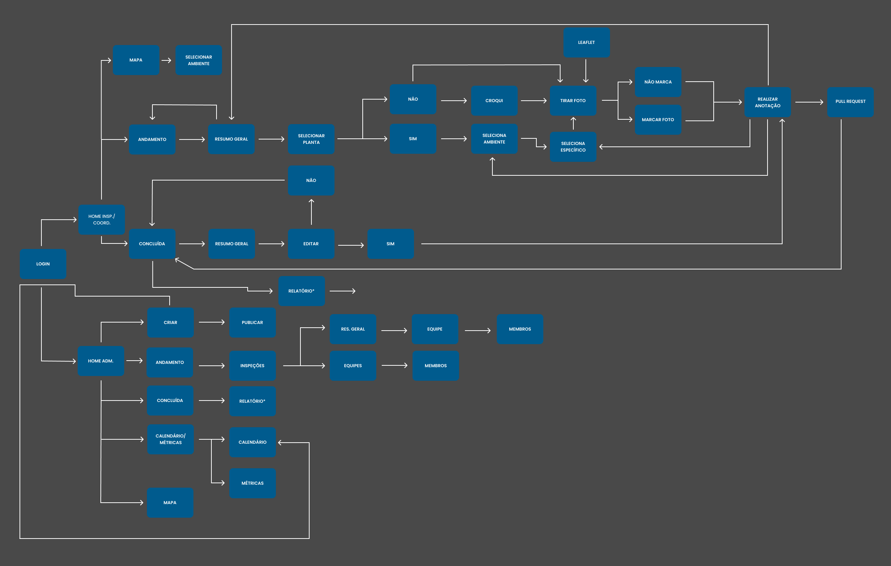
<div align="center">
</div>

<div align="center">
<sub>Fonte: autoria própria (2025)</sub>
<br> </br>
</div>

<div align="center">
  <a href="https://www.figma.com/design/WgYYML6WNUXA16jUh8SkPQ/Clouding?node-id=4-618">Link de acesso ao User Flow</a>
</div>

### **Wireframes de Baixa Fidelidade**

Nesta seção, são apresentados os **wireframes de baixa fidelidade** desenvolvidos para as plataformas mobile e desktop, segmentadas pelos perfis de Inspetor/Coordenador e Administrador. A seguir, detalharemos a função de cada tela, sua utilidade no fluxo da aplicação e a relação direta com as User Stories definidas previamente, garantindo que a solução atenda às necessidades e dores dos usuários mapeados. Após essa etapa, também serão apresentados os wireframes de média fidelidade, evidenciando as alterações realizadas com base em testes de usabilidade, validações com o parceiro de projeto e melhorias na experiência do usuário.

### Mobile – Inspetor/Coordenador

O wireframe mobile de baixa fidelidade, referente ao Inspetor/Coordenador, pode ser visualizado abaixo e, em seguida, apresenta-se a descrição de cada tela.

<div align="center">
<sub>Figura 10 - Wireframe Mobile Baixa Fidelidade (Inspetor/Coordenador)</sub>
<br>
</div>
<div>

<div align="center">
</div>

<div align="center">
<sub>Fonte: autoria própria (2025)</sub>
<br> </br>
</div>

<div align="center">
  <a href="https://www.figma.com/design/WgYYML6WNUXA16jUh8SkPQ/Clouding?node-id=4-617">Link de acesso ao Wireframe</a>
</div>

#### 1. Tela de Login
Tela inicial do aplicativo mobile, onde o usuário (inspetor ou coordenador) realiza o login para acessar o sistema. <br>
Essa tela está relacionada a todas as User Stories, pois representa o ponto de entrada na aplicação.

#### 2. Tela Inicial
A tela de início exibe duas seções: inspeções em andamento e inspeções concluídas, permitindo fácil navegação e organização das tarefas. <br>
Relacionada à US4, US7 e US8, pois nessa tela as inspeções em andamento podem ser visualizadas pelo inspetor e o progresso acompanhado pelo(a) coordenador(a).

#### 3. Tela de Resumo de Inspeção Concluída
Mostra uma prévia do relatório final, reunindo imagens e descrições já preenchidas. <br>
Relacionada à US1 e US9, pois permite ao administrador e inspetor consultar e exportar registros detalhados.

#### 4. Tela de Preenchimento de Inspeção em Andamento
Tela central da atividade do inspetor, onde ele preenche os campos da inspeção, acessa dados do imóvel e agenda. <br>
Relacionada à US4 e US9, pois fornece contexto da inspeção e estrutura para compor o relatório.

#### 5. Tela de Câmera
Interface para o inspetor fotografar problemas encontrados durante a vistoria. <br>
Relacionada à US5, pois permite capturar evidências visuais diretamente no app.

#### 6. Tela de Edição de Foto com Marcadores
O inspetor pode destacar a(s) patologia(s) com marcações visuais. <br>
Relacionada à US10, pois atende diretamente à necessidade de facilitar a compreensão das evidências fotográficas.

#### 7. Tela de Descrição da Patologia
Permite descrever o que foi identificado na imagem, incluindo observações técnicas. <br>
Relacionada à US5 e US9, por complementar a evidência com dados descritivos para o relatório.

#### 8. Tela de Pré-visualização do Trecho da Inspeção
O inspetor revisa como ficará aquela seção no relatório final antes de finalizar. <br>
Relacionada à US9, reforçando a etapa de verificação e qualidade do conteúdo registrado.

### Desktop – Inspetor/Coordenador

Apresenta-se a seguir o wireframe desktop de baixa fidelidade, referente ao Inspetor/Coordenador, e, em seguida, apresenta-se a descrição de cada tela.

<div align="center">
<sub>Figura 11 - Wireframe Desktop Baixa Fidelidade (Inspetor/Coordenador)</sub>
<br>
</div>
<div>
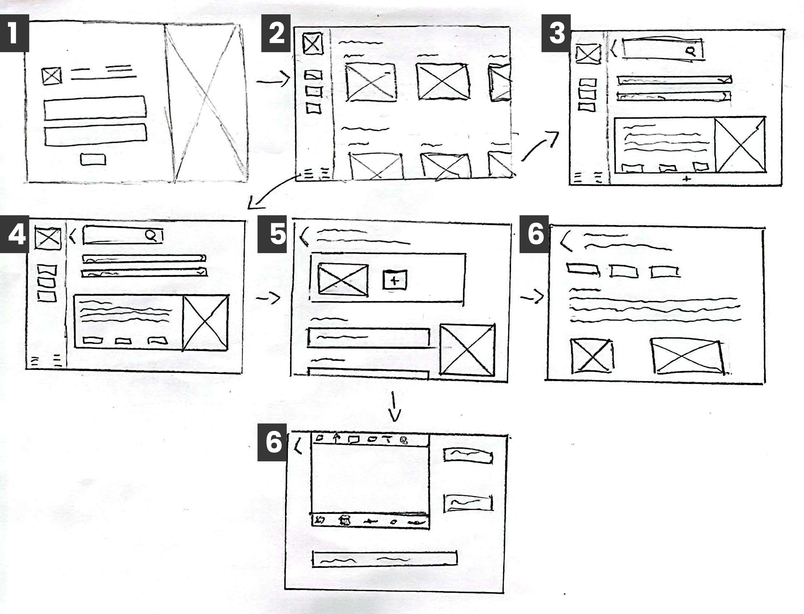
<div align="center">
</div>

<div align="center">
<sub>Fonte: autoria própria (2025)</sub>
<br> </br>
</div>

<div align="center">
  <a href="https://www.figma.com/design/WgYYML6WNUXA16jUh8SkPQ/Clouding?node-id=4-617">Link de acesso ao Wireframe</a>
</div>

#### 1. Tela de Login
Entrada ao sistema na versão desktop. <br>
Relacionada a todas as user stories como acesso principal ao sistema.

#### 2. Tela Inicial
Visualização organizada das inspeções em andamento e concluídas. <br>
Relacionada à US4, US7 e US8, como na versão mobile, garantindo controle e navegação rápida.

#### 3. Tela de Resumo da Inspeção Concluída
Prévia do relatório com detalhes relevantes para análise ou exportação. <br>
Relacionada à US1 e US9.

#### 4. Tela de Preenchimento de Inspeção em Andamento
Área para o inspetor seguir preenchendo a inspeção em tempo real, com mais espaço visual. <br>
Relacionada à US4 e US9.

#### 5. Tela de Edição de Imagem
Funcionalidade semelhante à mobile, com ferramentas gráficas para marcação em imagens. <br>
Relacionada à US10.

#### 6. Tela de Descrição da Patologia
Campo para inserção de detalhes textuais sobre a imagem. <br>
Relacionada à US5 e US9.

#### 7. Tela de Pré-visualização do Trecho da Inspeção
Revisão visual da parte da inspeção preenchida. <br>
Relacionada à US9.

### Mobile – Administrador

A seguir, apresenta-se o wireframe mobile de baixa fidelidade, referente ao administrador, e, então, a pode-se visualizar a descrição de cada tela.

<div align="center">
<sub>Figura 12 - Wireframe Mobile Baixa Fidelidade (Administrador)</sub>
<br>
</div>
<div>
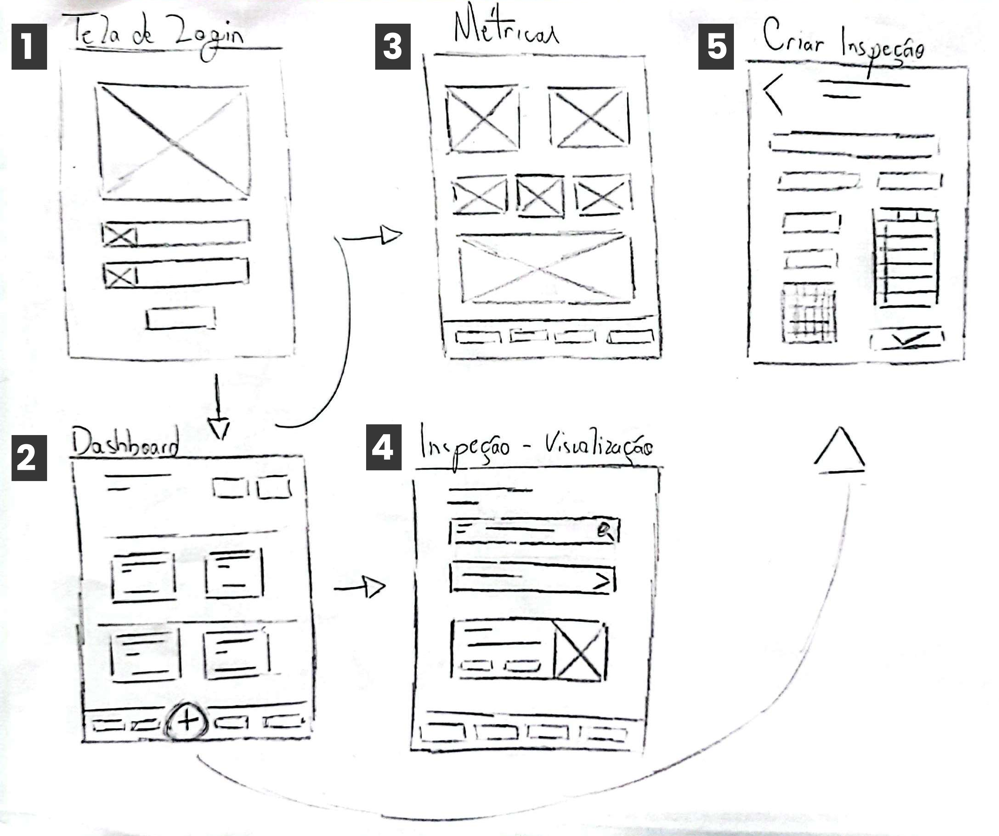
<div align="center">
</div>

<div align="center">
<sub>Fonte: autoria própria (2025)</sub>
<br> </br>
</div>

<div align="center">
  <a href="https://www.figma.com/design/WgYYML6WNUXA16jUh8SkPQ/Clouding?node-id=4-617">Link de acesso ao Wireframe</a>
</div>

#### 1. Tela de Login
Acesso ao dashboard administrativo. <br>
Relacionada à US1 e US6.

#### 2. Tela de Dashboard de Inspeções
Lista e categorização das inspeções em andamento e concluídas. <br>
Relacionada à US1 e US6.

#### 3. Tela de Métricas
Visualização estratégica com prazos, entregas e desempenho da equipe. <br>
Relacionada à US6, fornecendo visão ampla do cronograma e produtividade.

#### 4. Tela de Visualização da Inspeção
Permite acesso ao conteúdo completo de uma inspeção específica. <br>
Relacionada à US1.

#### 5. Tela de Criação de Inspeção
Formulário para o administrador configurar uma nova inspeção. <br>
Relacionada à US2 e US3.

### Desktop – Administrador

O wireframe desktop de baixa fidelidade, referente ao administrador, pode ser visualizado abaixo e, em seguida, apresenta-se a descrição de cada tela.

<div align="center">
<sub>Figura 13 - Wireframe Desktop Baixa Fidelidade (Administrador)</sub>
<br>
</div>
<div>

<div align="center">
</div>

<div align="center">
<sub>Fonte: autoria própria (2025)</sub>
<br> </br>
</div>

<div align="center">
  <a href="https://www.figma.com/design/WgYYML6WNUXA16jUh8SkPQ/Clouding?node-id=4-617">Link de acesso ao Wireframe</a>
</div>

#### 1. Tela de Login
Entrada do administrador via plataforma web. <br>
Relacionada à US1 e US6.

#### 2. Tela de Dashboard de Inspeções
Interface com filtros e painéis para inspeções em execução e finalizadas. <br>
Relacionada à US1 e US6.

#### 3. Tela de Métricas
Painel estratégico com KPIs, prazos e entregas pendentes. <br>
Relacionada à US6.

#### 4. Tela de Visualização de Inspeção
Visualização detalhada de um relatório de inspeção. <br>
Relacionada à US1.

#### 5. Tela de Criação de Inspeção
Área de configuração de novas inspeções, com seleção de profissionais e datas. <br>
Relacionada à US2 e US3.

### **Wireframes de Média Fidelidade**
Nesta seção, são apresentados os wireframes de média fidelidade desenvolvidos a partir da evolução das versões iniciais. Esses wireframes incorporam melhorias visuais e funcionais.
Além de aperfeiçoar a hierarquia visual e o layout das telas, essa etapa buscou aproximar o design final da experiência real do usuário, mantendo a coerência com o User Flow e as User Stories previamente mapeadas. Também foram realizadas adequações que visam melhorar a navegabilidade, clareza das informações e acessibilidade da interface.

### Mobile - Inspetor/Coordenador

Em seguida, apresenta-se o Wireframe mobile de média fidelidade, referente ao inspetor/coordenador, seguida da descrição de cada tela.

<div align="center">
<sub>Figura 14 - Wireframe Mobile Média Fidelidade (Inspetor/Coordenador)</sub>
<br>
</div>
<div>
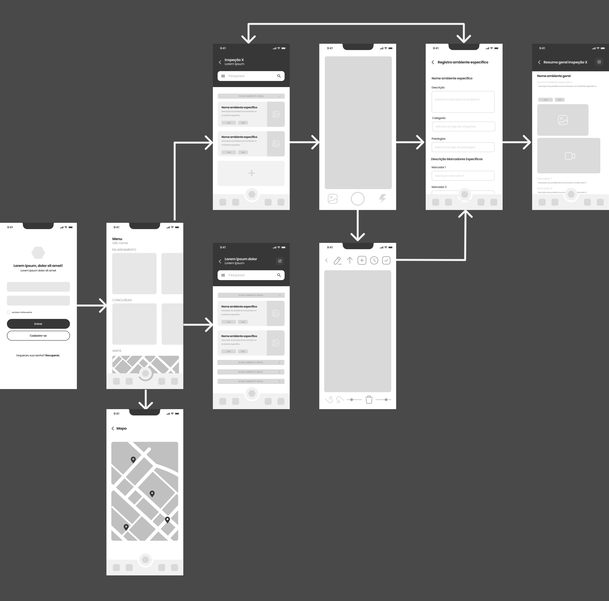
<div align="center">
</div>

<div align="center">
<sub>Fonte: autoria própria (2025)</sub>
<br> </br>
</div>

<div align="center">
  <a href="https://www.figma.com/design/WgYYML6WNUXA16jUh8SkPQ/Clouding?node-id=4-617">Link de acesso ao Wireframe</a>
</div>

#### Tela de Login
A tela de login é padronizada para todos os usuários (inspetores, coordenadores e administrador) e permite acesso à aplicação web, o que se alinha ao wireframe inicial de baixa fidelidade.

#### Tela de Início
Desenvolvida como tela principal de navegação para o usuário, a tela de início reúne a visualização e o acesso às inspeções em andamento, concluídas e ao mapa com inspeções em andamento atribuídas aos respectivos responsáveis. Atendendo às necessidades da **US03**, ao permitir que o inspetor visualize os status das inspeções de equipes que faz parte.

#### Tela de Inspeções em Andamento
A tela de inspeções em andamento permite que o inspetor acesse, altere e registre patologias encontradas nos ambientes de inspeção. Ao selecionar a inspeção em andamento, são exibidos detalhes técnicos como local, tipo de imóvel, patologia e data, atendendo à **US03**. Além disso, é possível iniciar registros por fotos ou textos, que se relacionam diretamente às **US04** e **US10**. Além disso, permite-se a exportação dos registros, atendendo à necessidade descrita na **US09**.

#### Tela de Câmera
A tela de câmera foi desenvolvida para centralizar também o registro fotográfico das patologias encontradas durante as inspeções, atendendo à **US04**, que exige fotografar e anexar as imagens aos locais inspecionados.

#### Tela de Edição de Foto
Para permitir marcações e anotações diretamente sobre as imagens fotografadas, antes ou depois de associá-la ao ambiente específico, foi desenvolvida a tela de edição de foto, atendendo assim à **US10**, para que os marcadores facilitem a compreensão posterior das imagens anexadas à inspeção.

#### Tela de Criação de Registro do Ambiente Específico
Essa tela foi desenvolvida para que o inspetor possa realizar o registro textual completo das patologias encontradas na inspeção. Pode ser acessada após a captura ou edição de imagem, ou diretamente pela inspeção em andamento, atendendo às **US04**, pois contém campos como nome do ambiente, categoria, descrição e marcadores, e **US09**, já que permite a exportação posterior dos dados necessários.

#### Tela de Pré-visualização da Inspeção
A tela de pré-visualização permite que o inspetor revise os registros realizados durante a inspeção antes de adicioná-la a tela de inspeções concluídas, contribuindo para o acompanhamento em tempo real da inspeção por parte do(a) coordenador(a), de acordo com a **US08**, e permitindo validar e consolidar as informações a serem exportadas, como estabelecido pela **US09**.

#### Tela de Inspeções Concluídas
A tela de inspeções concluídas foi desenvolvida para disponibilizar o histórico de inspeções, atendendo, portanto, às **US09** e **US07**, uma vez que permite o usuário consultar os registros exportados e facilita a consulta de dados básicos das inspeções passadas para o(a) coordenador(a).

#### Tela de Mapa
A tela com acesso ao mapa de inspeções foi desenvolvida para permitir uma visualização geográfica das inspeções em andamento atribuídas ao usuário. Ao clicar em uma inspeção no mapa, o usuário é redirecionado à tela de andamento correspondente. Essa funcionalidade atende à **US03**, auxiliando o inspetor a identificar a localização da inspeção, e à **US08**, fornecendo uma visão espacial do progresso das inspeções em campo.

### Desktop - Inspetor/Coordenador

O wireframe desktop de média fidelidade, referente ao inspetor/coordenador, pode ser visualizado abaixo e, em seguida, apresenta-se a descrição de cada tela.

<div align="center">
<sub>Figura 15 - Wireframe Desktop Média Fidelidade (Inspetor/Coordenador)</sub>
<br>
</div>
<div>
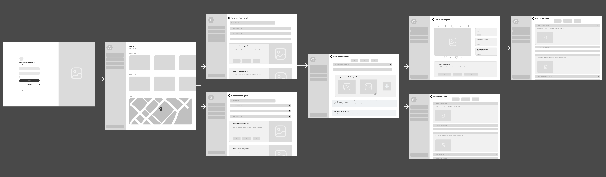
<div align="center">
</div>

<div align="center">
<sub>Fonte: autoria própria (2025)</sub>
<br> </br>
</div>

<div align="center">
  <a href="https://www.figma.com/design/WgYYML6WNUXA16jUh8SkPQ/Clouding?node-id=4-617">Link de acesso ao Wireframe</a>
</div>

As telas desenvolvidas para a versão mobile da aplicação foram adaptadas para o ambiente desktop, com exceção da tela de câmera, que permanece exclusiva da versão mobile. A responsividade, portanto, garante que os elementos se adequem as dimensões dessa versão, preservando a usabilidade e organização de acesso às inspeções.

### Mobile - Administrador

Apresenta-se, a seguir, o wireframe mobile de média fidelidade, referente ao inspetor/coordenador, seguido da descrição de cada tela.

<div align="center">
<sub>Figura 16 - Wireframe Mobile Média Fidelidade (Inspetor/Coordenador)</sub>
<br>
</div>
<div>
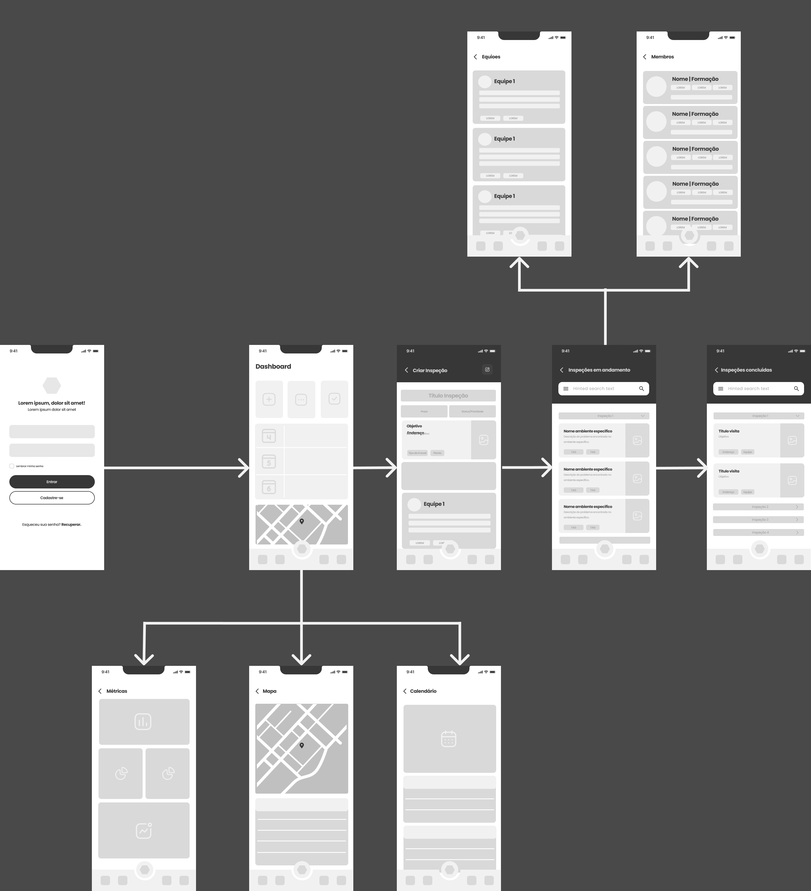
<div align="center">
</div>

<div align="center">
<sub>Fonte: autoria própria (2025)</sub>
</div>

<div align="center">
  <a href="https://www.figma.com/design/WgYYML6WNUXA16jUh8SkPQ/Clouding?node-id=4-617">Link de acesso ao Wireframe</a>
</div>

#### Tela de Login
A tela de login está alinhada com o wireframe inicial, que permite acesso à aplicação web.

#### Tela de Início
A tela, tem objetivo de fornecer visão geral, como necessitado na US06. O administrador pode criar novas inspeções, acompanhar as que estão em andamento ou já concluídas. O calendário exibe as atividades do dia, com destaques para as prioridades e entregas, acompanhado por uma barra de progresso. Ao clicar nos números, o usuário é direcionado para a tela do calendário, e ao interagir com a barra de progresso, é levado à tela de métricas. Ademais, no final da tela, há um mapa interativo com pins marcando as localidades que possuem inspeções agendadas.

#### Tela de Criar Inspeção
A tela foi desenvolvida como um formulário de criação para o administrador, atendendo às necessidades da US02, com campos específicos como prazo e endereço. Além disso, é possível criar equipes diretamente nesta página, adicionar tags, selecionar o status e definir a priorização da inspeção.

#### Tela de Inspeções em andamento
Na tela, o administrador poderá acompanhar as inspeções em andamento. Além disso, será possível visualizar as equipes e seu progresso, assim como o desempenho e os processos individuais de cada membro, conforme solicitado na US01, para o monitoramento do desempenho dos funcionários.

#### Tela de Inspeções concluídas
Nesta tela, será possível visualizar o resumo final das inspeções, além de funcionar como um repositório e histórico das inspeções anteriores. O histórico será de fácil acesso, permitindo consultas rápidas e comparações entre inspeções realizadas.

#### Tela de Calendário
Na página calendário, as entregas do dia serão destacadas na parte superior da tela, enquanto as demais entregas, mesmo que não estejam em ordem cronológica direta, estarão visíveis de forma organizada.

#### Tela de Métricas
A tela apresenta poucas alterações em relação ao wireframe de baixa fidelidade, mantendo o foco na exibição de métricas gerais das inspeções, como desempenho e progresso. 

#### Tela de Mapa
Na página, será possível expandir o mapa para visualizar, de forma detalhada, as localidades com inspeções agendadas.

#### Tela de Equipes
Na tela, o administrador terá acesso às suas equipes, com a indicação das inspeções realizadas e a visualização dos membros que compõem cada grupo. Além disso, serão exibidas métricas de desempenho da equipe.

#### Tela de Membros
Na página, será possível identificar os membros individualmente e acompanhar o progresso de cada um nas inspeções.

Com base nas user stories e no user flow definido, as telas foram atualizadas para atender às necessidades específicas da persona administradora, priorizando a organização, a padronização das informações e o acompanhamento eficiente das inspeções. A partir dos wireframes de baixa fidelidade, foi possível estruturar e validar as principais funcionalidades, garantindo uma transição consistente para interfaces mais refinadas. O resultado é uma experiência mais fluida e intuitiva, que oferece visão clara das atividades das equipes, facilita o monitoramento do desempenho e resolve as principais dores identificadas na etapa de pesquisa com a persona, como a falta de controle visual e histórico centralizado.

### Desktop - Administrador

O wireframe desktop de média fidelidade, referente a o Administrador, pode ser visualizado abaixo e, em seguida, apresenta-se a descrição de cada tela.

<br>
<div align="center">
<sub>Figura 17 - Wireframe Desktop Média Fidelidade (Administrador)</sub>
<br>
</div>
<div>

<div align="center">
</div>

<div align="center">
<sub>Fonte: autoria própria (2025)</sub>
<br> </br>
</div>

<div align="center">
  <a href="https://www.figma.com/design/WgYYML6WNUXA16jUh8SkPQ/Clouding?node-id=4-617">Link de acesso ao Wireframe</a>
</div>

As mesmas telas desenvolvidas para a versão mobile foram adaptadas para o modelo desktop, garantindo uma experiência consistente entre dispositivos. A responsividade foi trabalhada para que os elementos se ajustem de forma adequada às dimensões maiores, preservando a usabilidade, a organização das informações e a fluidez da navegação.


## 3.3. Guia de estilos (sprint 3)

_Descreva aqui orientações gerais para o leitor sobre como utilizar os componentes do guia de estilos de sua solução_

### 3.3.1 Cores

_Apresente aqui a paleta de cores, com seus códigos de aplicação e suas respectivas funções_

### 3.3.2 Tipografia

_Apresente aqui a tipografia da solução, com famílias de fontes e suas respectivas funções_

### 3.3.3 Iconografia e imagens

_(esta subseção é opcional, caso não existam ícones e imagens, apague esta subseção)_

_posicione aqui imagens e textos contendo exemplos padronizados de ícones e imagens, com seus respectivos atributos de aplicação, utilizadas na solução_

## 3.4 Protótipo de alta fidelidade (sprint 3)

_posicione aqui algumas imagens demonstrativas de seu protótipo de alta fidelidade e o link para acesso ao protótipo completo (mantenha o link sempre público para visualização)_

## 3.5. Modelagem do banco de dados (sprints 2 e 4)

### 3.5.1. Modelo relacional (sprints 2 e 4)

O modelo relacional organiza os dados em relações predefinidas (GOOGLE CLOUD, 2025), nas quais os dados são armazenados em diferentes tabelas compostas por colunas e linhas, facilitando a compreensão e a visualização das relações entre os atributos dentro do banco de dados. Na nossa aplicação web, o modelo relacional foi utilizado para facilitar a organização e a manipulação dos dados.


<br>
<div align="center">
<sub>Figura 24 - Modelo Relacional </sub>
</div>
<div>
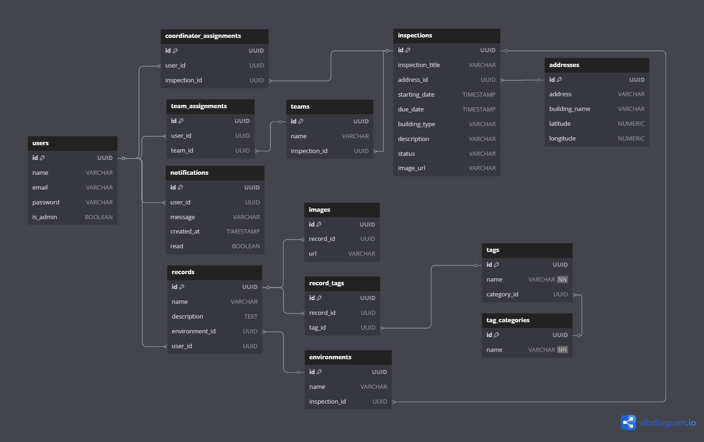
<div align="center">
</div>

<div align="center">
<sub>Fonte: autoria própria (2025)</sub>
<br> </br>
</div>

### Descrição do banco de dados

---

No **_SQL_**, os dados são organizados de maneira **relacional**, registrando as informações por meio de **tabelas e linhas**. Essas tabelas são capazes de se relacionar por meio de chaves primárias (_primary keys_) e chaves estrangeiras (_foreign keys_). As **chaves primárias** servem para identificar **unicamente** cada linha de uma tabela, evitando possíveis problemas de conflito. Já as **chaves estrangeiras** resgatam os registros de outra tabela, se baseando na chave **primária**, tornando essa relação possível.

Já a **cardinalidade** demonstra a relação entre diferentes **instâncias** no banco de dados. Por exemplo, no caso de um time de futebol, um técnico comanda vários jogadores, porém cada jogador tem apenas um técnico. Nesse caso, temos uma **relação de um para muitos**, já que uma entidade (técnico) se relaciona com várias instâncias (jogadores), porém o oposto não é correto.


### Legenda:

**Texto em negrito** refere-se à uma tabela;

`Texto marcado` refere-se à um atributo da tabela;

(PK) - Chave Primária (_Private Key_);

(FK) - Chave Estrangeira (_Foreign Key_);

(1:1) - Cardinalidade um para um;

(1:N) - Cardinalidade um para muitos;

(N:M) - Cardinalidade muitos para muitos.   


 
---
<br>

**users**: Representa os usuários da aplicação. 

- `id`: Identifica unicamente cada registro de usuário. (PK)

- `name`: Guarda o nome do utilizador.

- `email`: Registra o email fornecido pelo usuário.

- `password`: Armazena a senha escolhida.

- `is_admin`: Determina se o utilizador tem permissão para acessar as funcionalidades de administrador.

<br>

**addresses**: Guarda os endereços dos locais de inspeção.

- `id`: Identifica unicamente cada endereço. (PK)

- `address`: Guarda o endereço do local.

- `building_name`: Armazena o nome do edifício relacionado ao endereço.

- `latitude`: Verifica as coordenadas de latitude do endereço.

- `longitude`: Verifica as coordenadas de longitude do endereço.

<br>

**inspections**: Registra as inspeções que serão realizadas.

- `id`: Identifica unicamente cada inspeção. (PK)

- `inspection_title`: Guarda o título definido para a inspeção.

- `address_id`: Identificador baseado no `id` de **addresses**. (FK)

- `starting_date`: Guarda a data de início da inspeção.

- `due_date`: Guarda a data limite para a execução da inspeção.

- `building_type`: Registra o tipo de edifício que a inspeção será realizada.

- `description`: Armazena uma descrição textual da inspeção.

- `status`: Marca o _status_ atual da inspeção.

- `image_url`: Guarda o link da imagem ilustrativa da inspeção.

<br>

**teams**: Cria as equipes com base em uma inspeção.

- `id`: Identifica unicamente cada equipe. (PK)

- `name`: Atribui um nome para a equipe.

- `team_id`: Identificador baseado no `id` de **inspections**. (FK)

<br>

**team_assignments**: Relaciona os usuários com as equipes.

- `id`: Identifica unicamente cada registro de um usuário para a equipe. (PK)

- `user_id`: Identificador baseado no `id` de **users**. (FK)

- `team_id`: Identificador baseado no `id` de **teams**. (FK)

<br>

**coordinator_assignments**: Relaciona os usuários com as equipes.

- `id`: Identifica unicamente cada registro de um usuário para a equipe. (PK)

- `user_id`: Identificador baseado no `id` de **users**. (FK)

- `inspection_id`: Identificador baseado no `id` de **inspections**. (FK)

<br>

**records**: Armazena as informações de um registro da inspeção.

- `id`: Identifica unicamente cada registro. (PK)

- `name`: Armazena o nome do registro.

- `description`: Armazena a descrição do registro.

- `environment_id`: Identificador baseado no `id` de **environments**. (FK)

- `user_id`: Identificador baseado no `id` de **users**. (FK)

<br>

**record_tags**: Relaciona as tags com os registros, permitindo a sua atribuição.

- `id`: Identifica unicamente cada tag relacionada ao registro. (PK)

- `record_id`: Identificador baseado no `id` de **records**. (FK)

- `tag_id`: Identificador baseado no `id` de **tags**. (FK)

<br>

**tags**: Guarda as tags utilizadas para classificar os registros.

- `id`: Identifica unicamente cada tag. (PK)

- `name`: Armazena o nome da tag. 

- `category_id`: Identificador baseado no `id` de **tag_categories**. (FK)

<br>

**tag_categories**: Armazena as categorias utilizadas pelas tags.

- `id`: Identifica unicamente cada categoria. (PK)

- `name`: Armazena o nome da categoria.

<br>

**environments**: Armazena os ambientes de uma inspeção.

- `id`: Identifica unicamente cada registro de um ambiente. (PK)

- `name`: Guarda o nome de um ambiente.

- `inspection_id`: Identificador baseado no `id` de **inspections**. (FK)

<br>

**images**: Armazena as imagens relacionadas aos registros.

- `id`: Identifica unicamente cada imagem. (PK)

- `record_id`: Identificador baseado no `id` de **records**. (FK)

- `url`: Guarda o _URL_ da imagem.

- `image_data`: Armazena os metadados ou dados adicionais da imagem.

<br>

**notifications**: Armazena as notificações enviadas aos usuários.

- `id`: Identifica unicamente cada notificação. (PK)

- `user_id`: Identificador baseado no `id` de **users**. (FK)

- `message`: Armazena o conteúdo da notificação.

- `created_at`: Registra a data e hora de criação da notificação.

- `read`: Indica se a notificação foi lida (`true` ou `false`).

<br>


#### Cardinalidades:

**addresses** <---> **inspections**

(1:N) - Um endereço para ser atribuído para múltiplas inspeções, porém uma inspeção não pode ser atribuída para múltiplos endereços.

<br>

**inspections** <---> **coordinator_assignments**

(N:M) - Múltiplas instâncias de inspeções podem se relacionar a múltiplas atribuições para coordenadores. A tabela **coordinator_assignments** foi criada para permitir esse tipo de relação.

<br>

**users** <---> **coordinator_assignments**

(N:M) - Múltiplas instâncias de usuários podem se relacionar a múltiplas atribuições para coordenadores. A tabela **coordinator_assignments** foi criada para permitir esse tipo de relação.

<br>

**inspections** <---> **teams**

(1:N) - Uma inspeção pode ter múltiplas equipes, mas uma equipe não pode ser atribuída para múltiplas inspeções.

**teams** <---> **team_assignments**

(N:M) - Múltiplas instâncias de equipes podem se relacionar a mútliplas atribuições de usuários. A tabela **team_assignments** foi criada para permitir esse tipo de relação.

**users** <---> **team_assignments**

(N:M) - Múltiplas instâncias de usuários podem se relacionar a múltiplas atribuições de equipes. A tabela **team_assignments** foi criada para permitir esse tipo de relação.

**inspections** <---> **environments**

(1:N) - Uma inspeção pode ter vários ambientes, porém um ambiente pode pertencer apenas à uma inspeção.

**tag_categories** <---> **tags**

(1:N) - Uma categoria pode ter várias tags, porém cada tag pertence apenas à uma categoria.

**environments** <---> **records**

(1:N) - Um ambiente pode ter vários registros, mas um registro pertence apenas à um ambiente.


**records** <---> **record_tags**

(N:M) Múltiplas instâncias de registros podem se relacionar à múltiplas atribuições de tags. A tabela **record_tags** foi criada para permitir esse tipo de relação.

**tags** <---> **record_tags**

(N:M) <---> Múltiplas instâncias de tags podem se relacionar à múltiplas atribuições de registros. A tabela **record_tags** foi criada para permitir esse tipo de relação.

**images** <---> **records**

(1:N) Um registro pode ter múltiplas imagens, mas uma imagem pertence à apenas um registro.

**notifications** <--> **users**

(1:N) Um usuário pode ter múltiplas notificações, mas uma notificação pertence à apenas um usuário.


### Modelo físico

Segundo a empresa de tecnologia _AMAZON_ (2024), o **modelo físico** é a última etapa da **modelagem do banco de dados**, refinando aquilo que já foi trabalhado e passando a organização para uma tecnologia específica. No caso de nosso projeto, estamos utilizando da linguagem **_SQL_** para a **criação** e **consulta** do banco de dados. 

O modelo físico pode ser visto [aqui.](../src/sql/create-tables.sql)


### 3.5.2. Consultas SQL e lógica proposicional (sprint 2)

As consultas SQL dentro do back-end de uma aplicação web são responsáveis por inserir, acessar, atualizar ou deletar informações, conforme requisitado pelo front-end do site. Elas são essenciais para garantir que as informações sejam armazenadas corretamente após alguma ação realizada pelo usuário, mantendo a integridade e a segurança da aplicação. Dentre as funcionalidades que serão implementadas utilizando as consultas, podemos destacar o armazenamento de dados e relatórios, permitir acesso às inspeções e a filtragem de conteúdos.

### Proposição SQL 1 - Filtrar inspeções industriais pendentes com equipe

Essa consulta seleciona inspeções industriais com status pendentes ou atrasados e que possuem uma equipe atribuída.


| \#1 |  |
| :-- | :-- |
| **Expressão SQL** | SELECT * FROM inspections <br> WHERE status IN ('pending', 'delayed') AND building_type = 'industrial' AND <br> EXISTS (SELECT 1 FROM equipes WHERE equipes.inspection_id = inspections. id); |
| **Proposições lógicas** | $A$: O status é 'pending' <br> $B$: O status é 'delayed' <br> $C$: O tipo de prédio é industrial (building_type = 'industrial') <br> $D$: A inspeção possui uma equipe associada (EXISTS na tabela equipes com inspection_id correspondente) |
| **Expressão lógica proposicional** | $(A \lor B) \land C \land D$ |
| **Tabela Verdade** | <table> <thead> <tr> <th>$A$</th> <th>$B$</th> <th>$C$</th> <th>$D$</th> <th>$(A \lor B) \land C \land D$</th> </tr> </thead> <tbody> <tr> <td>F</td> <td>F</td> <td>F</td> <td>F</td> <td>F</td> </tr> <tr> <td>F</td> <td>F</td> <td>F</td> <td>V</td> <td>F</td> </tr> <tr> <td>F</td> <td>F</td> <td>V</td> <td>F</td> <td>F</td> </tr> <tr> <td>F</td> <td>F</td> <td>V</td> <td>V</td> <td>F</td> </tr> <tr> <td>F</td> <td>V</td> <td>F</td> <td>F</td> <td>F</td> </tr> <tr> <td>F</td> <td>V</td> <td>F</td> <td>V</td> <td>F</td> </tr> <tr> <td>F</td> <td>V</td> <td>V</td> <td>F</td> <td>F</td> </tr> <tr> <td>F</td> <td>V</td> <td>V</td> <td>V</td> <td>V</td> </tr> <tr> <td>V</td> <td>F</td> <td>F</td> <td>F</td> <td>F</td> </tr> <tr> <td>V</td> <td>F</td> <td>F</td> <td>V</td> <td>F</td> </tr> <tr> <td>V</td> <td>F</td> <td>V</td> <td>F</td> <td>F</td> </tr> <tr> <td>V</td> <td>F</td> <td>V</td> <td>V</td> <td>V</td> </tr> <tr> <td>V</td> <td>V</td> <td>F</td> <td>F</td> <td>F</td> </tr> <tr> <td>V</td> <td>V</td> <td>F</td> <td>V</td> <td>F</td> </tr> <tr> <td>V</td> <td>V</td> <td>V</td> <td>F</td> <td>F</td> </tr> <tr> <td>V</td> <td>V</td> <td>V</td> <td>V</td> <td>V</td> </tr> </tbody> </table> |

<br>

### Proposição SQL 2 - Cancelar inspeções vencidas ou sem equipe

Essa consulta atualiza o status da inspeção para cancelado caso o prazo tenha sido ultrapassado e não tenha sido concluída, ou quando a inspeção foi agendada, porém, não possui nenhuma equipe designada para realizá-la.


| \#2 |  |
| :-- | :-- |
| **Expressão SQL** | UPDATE inspections <br> SET status = 'canceled' <br> WHERE (status <> 'completed' AND due\_date < NOW()) <br> OR (status = 'pending' AND NOT EXISTS (SELECT 1 FROM equipes WHERE equipes.inspection\_id = inspections. id)); |
| **Proposições lógicas** | $A$: O status não é 'completed' (status <> 'completed') <br> $B$: A data de vencimento já passou (due\_date < NOW()) <br> $C$: O status é 'pending' <br> $D$: Existe equipe associada (EXISTS na tabela equipes com inspection\_id correspondente) |
| **Expressão lógica proposicional** | $(A \land B) \lor (C \land \neg D)$ |
| **Tabela Verdade** | <table> <thead> <tr> <th>$A$</th> <th>$B$</th> <th>$C$</th> <th>$D$</th> <th>$(A \land B) \lor (C \land \neg D)$</th> </tr> </thead> <tbody> <tr> <td>F</td> <td>F</td> <td>F</td> <td>F</td> <td>F</td> </tr> <tr> <td>F</td> <td>F</td> <td>F</td> <td>V</td> <td>F</td> </tr> <tr> <td>F</td> <td>F</td> <td>V</td> <td>F</td> <td>V</td> </tr> <tr> <td>F</td> <td>F</td> <td>V</td> <td>V</td> <td>F</td> </tr> <tr> <td>F</td> <td>V</td> <td>F</td> <td>F</td> <td>F</td> </tr> <tr> <td>F</td> <td>V</td> <td>F</td> <td>V</td> <td>F</td> </tr> <tr> <td>F</td> <td>V</td> <td>V</td> <td>F</td> <td>V</td> </tr> <tr> <td>F</td> <td>V</td> <td>V</td> <td>V</td> <td>F</td> </tr> <tr> <td>V</td> <td>F</td> <td>F</td> <td>F</td> <td>F</td> </tr> <tr> <td>V</td> <td>F</td> <td>F</td> <td>V</td> <td>F</td> </tr> <tr> <td>V</td> <td>F</td> <td>V</td> <td>F</td> <td>V</td> </tr> <tr> <td>V</td> <td>F</td> <td>V</td> <td>V</td> <td>F</td> </tr> <tr> <td>V</td> <td>V</td> <td>F</td> <td>F</td> <td>V</td> </tr> <tr> <td>V</td> <td>V</td> <td>F</td> <td>V</td> <td>V</td> </tr> <tr> <td>V</td> <td>V</td> <td>V</td> <td>F</td> <td>V</td> </tr> <tr> <td>V</td> <td>V</td> <td>V</td> <td>V</td> <td>V</td> </tr> </tbody> </table> |

<br>

### Proposição SQL 3 - Remover registros incompletos

Essa consulta remove registros que não estão vinculados a nenhuma inspeção ou não possuem imagens.


| \#3 |  |
| :-- | :-- |
| **Expressão SQL** | DELETE FROM registros <br> WHERE NOT EXISTS ( <br>    SELECT 1 FROM images <br>    WHERE images.registros\_id = registros.id <br>) <br>OR inspection\_id IS NULL; |
| **Proposições lógicas** | $A$: O registro possui imagens associadas (EXISTS na tabela images com registros\_id correspondente) <br> $B$: O registro está vinculado a uma inspeção (inspection\_id IS NOT NULL) |
| **Expressão lógica proposicional** | $\neg A \lor \neg B$ |
| **Tabela Verdade** | <table> <thead> <tr> <th>$A$</th> <th>$B$</th> <th>$\neg A \lor \neg B$</th> </tr> </thead> <tbody> <tr> <td>F</td> <td>F</td> <td>V</td> </tr> <tr> <td>F</td> <td>V</td> <td>V</td> </tr> <tr> <td>V</td> <td>F</td> <td>V</td> </tr> <tr> <td>V</td> <td>V</td> <td>F</td> </tr> </tbody> </table> |

## 3.6. WebAPI e endpoints (sprints 3 e 4)

A seguir estão listados os endpoints elaborados até o momento para a aplicação web. Ainda ocorrerão mudanças conforme a integração do frontend com o backend ocorre. A maioria dessas requisições podem ser testadas por meio do Postman ou outra ferramenta similiar, enquanto outras já podem ser testadas ativamente na aplicação. (Para informações de como iniciar a aplicação, consulte o [README.md](../README.md). As seções já disponíveis na aplicação estarão explicitadas em cada endpoint adiante:

### Endereços

O endpoint address é responsável pelas interações com a tabela de endereços. Ele está diretamente relacionado com a User Story 01, que se trata da criação de novas inspeções. Outras funcionalidades da aplicação também utilizarão dessas requisições, principalmente a funcionalidade do mapa.

<br>

| # | Endpoint | Método | Content-Type | Body/Params | Descrição da Resposta |
|---|----------|--------|--------------|-------------|------------------------|
| 1 | **/api/addresses** | GET | application/json | - | Lista todos os endereços cadastrados: `{ "id": "uuid", "address": "nome da rua", "building_name": "nome do edifício", "latitude": 00.000000, "longitude": 00.000000 }` |
| 2 | **/api/addresses** | POST | application/json | `{ "address": "nome da rua", "building_name": "nome do edifício", "latitude": 00.000000, "longitude": 00.000000 }` | Cria um novo endereço: `{ "id": "uuid", "address": "nome da rua", "building_name": "nome do edifício", "latitude": 00.000000, "longitude": 00.000000 }` |
| 3 | **/api/addresses/:id** | PUT | application/json | `{ "address": "nome da rua atualizada", "building_name": "nome do edifício", "latitude": 00.000000, "longitude": 00.000000 }` | Atualiza um endereço existente: `{ "id": "uuid", "address": "nome da rua atualizada", "building_name": "nome do edifício", "latitude": 00.000000, "longitude": 00.000000 }` |
| 4 | **/api/addresses/:id** | DELETE | application/json | - | Deleta um endereço: `{ "id": "uuid", "address": "nome da rua", "building_name": "nome do edifício", "latitude": 00.000000, "longitude": 00.000000 }` |
| 5 | **/api/addresses/getById** | GET | application/json | SearchParams: `{ id: string }` | Obtém um endereço pelo ID: `{ "id": "uuid", "address": "nome da rua", "building_name": "nome do edifício", "latitude": 00.000000, "longitude": 00.000000 }` |

### Inspeções

O endpoint inspections é responsável pelas interações com a tabela de inspeções. Ele está diretamente relacionado com as User Stories 01, 04, 06 e 11. Elas se tratam da criação de novos inspeções, a consulta das mesmas e até mesmo da metrificação dos dados para o administrador. Parte dessas informações são manipuladas pelas consultas à seguir:

<br>

| # | Endpoint | Método | Content-Type | Body/Params | Descrição da Resposta |
|---|----------|--------|--------------|-------------|------------------------|
| 6 | **/api/inspections** | GET | application/json | - | Lista todas as inspeções: `{ "id": "uuid", "inspection_title": "título da inspeção", "address_id": "uuid-endereço", "starting_date": "data-início", "due_date": "data-fim", "building_type": "tipo-edifício", "status": "status-inspeção" }` |
| 7 | **/api/inspections** | POST | application/json | `{ "inspection_title": "título da inspeção", "address_id": "uuid-endereço", "starting_date": "data-início", "due_date": "data-fim", "building_type": "tipo-edifício", "status": "status-inspeção" }` | Cria uma nova inspeção: `{ "id": "uuid", "inspection_title": "título da inspeção", "address_id": "uuid-endereço", "starting_date": "data-início", "due_date": "data-fim", "building_type": "tipo-edifício", "status": "status-inspeção" }` |
| 8 | **/api/inspections/:id** | PUT | application/json | `{ "inspection_title": "título da inspeção", "address_id": "uuid-endereço", "starting_date": "data-início", "due_date": "data-fim", "building_type": "tipo-edifício", "status": "status-atualizado" }` | Atualiza uma inspeção existente: `{ "id": "uuid", "inspection_title": "título da inspeção", "address_id": "uuid-endereço", "starting_date": "data-início", "due_date": "data-fim", "building_type": "tipo-edifício", "status": "status-atualizado" }` |
| 9 | **/api/inspections/:id** | DELETE | application/json | - | Deleta uma inspeção: `{ "id": "uuid", "inspection_title": "título da inspeção", "address_id": "uuid-endereço", "starting_date": "data-início", "due_date": "data-fim", "building_type": "tipo-edifício", "status": "status-inspeção" }` |
| 10 | **/api/inspections/getById** | GET | application/json | SearchParams: `{ id: string }` | Obtém uma inspeção pelo ID: `{ "id": "uuid", "inspection_title": "título da inspeção", "address_id": "uuid-endereço", "starting_date": "data-início", "due_date": "data-fim", "building_type": "tipo-edifício", "status": "status-inspeção" }` |
| 11 | **/api/inspections/calendar** | GET | application/json | - | Obtém inspeções formatadas para exibição em calendário: `{ "success": true, "inspections": [ ... ] }` |
| 12 | **/api/inspections/nextDueDate** | GET | application/json | - | Obtém inspeções com próximas datas de vencimento: `{ "success": true, "inspections": [ ... ] }` |

### Usuários

O endpoint users é responsável por diferenciar os diferentes tipos de usuários da aplicação vistos nas Personas e User Stories. É por meio da utilização desse endpoint que é possível validar as credenciais de cada usuário, garantindo que ele faz parte do sistema, além de verificar a sua posição. Ele já está presente na primeira versão da aplicação web. Para acessar qualquer outra das rotas, é necessário passar pela tela de login primeiro.

<br>

| # | Endpoint | Método | Content-Type | Body/Params | Descrição da Resposta |
|---|----------|--------|--------------|-------------|------------------------|
| 13 | **/api/users** | GET | application/json | - | Lista todos os usuários: `{ "id": "uuid", "name": "nome do usuário", "email": "email@exemplo.com", "password": "senha-hash", "is_admin": boolean }` |
| 14 | **/api/users** | POST | application/json | `{ "name": "nome do usuário", "email": "email@exemplo.com", "password": "senha", "is_admin": boolean }` | Cria um novo usuário: `{ "id": "uuid", "name": "nome do usuário", "email": "email@exemplo.com", "password": "senha-hash", "is_admin": boolean }` |
| 15 | **/api/users/:id** | PUT | application/json | `{ "name": "nome do usuário", "email": "email@exemplo.com", "password": "senha", "is_admin": boolean }` | Atualiza um usuário existente: `{ "id": "uuid", "name": "nome do usuário", "email": "email@exemplo.com", "password": "senha-hash", "is_admin": boolean }` |
| 16 | **/api/users/:id** | DELETE | application/json | - | Deleta um usuário: `{ "id": "uuid", "name": "nome do usuário", "email": "email@exemplo.com", "password": "senha-hash", "is_admin": boolean }` |

### Configurações de Usuário

O endpoint user/profile é responsável por diferenciar os diferentes tipos de usuários da aplicação vistos nas Personas e User Stories. É por meio da utilização desse endpoint que é possível validar as credenciais de cada usuário, garantindo que ele faz parte do sistema, além de ter acesso à alfumas informações do usuário.

<br>

| # | Endpoint | Método | Content-Type | Body/Params | Descrição da Resposta |
|---|----------|--------|--------------|-------------|------------------------|
| 17 | **/api/user/profile** | GET | application/json | - | Obtém o perfil do usuário: `{ "id": "uuid", "name": "nome do usuário", "email": "email@exemplo.com", "is_admin": boolean }` |
| 18 | **/api/user/profile** | POST | application/json | `{ "name": "nome do usuário", "email": "email@exemplo.com", "password": "senha" }` | Atualiza o perfil do usuário: `{ "id": "uuid", "name": "nome do usuário", "email": "email@exemplo.com", "is_admin": boolean }` |

### Atribuições de Coordenador

O endpoint coordinator_assignment é responsável pelas interações com a tabela de atribuição do coordenador. Ele está diretamente relacionado com as User Stories 02, 05, 09 e 10, já que todas requerem a distinguição de um coordenador, fato que ocorre por meio da manipulação dessa tabela.

<br>

| # | Endpoint | Método | Content-Type | Body/Params | Descrição da Resposta |
|---|----------|--------|--------------|-------------|------------------------|
| 19 | **/api/coordinator_assignments** | GET | application/json | - | Lista todas as atribuições de coordenador: `{ "id": "uuid", "user_id": "uuid-usuário", "inspection_id": "uuid-inspeção" }` |
| 20 | **/api/coordinator_assignments** | POST | application/json | `{ "user_id": "uuid-usuário", "inspection_id": "uuid-inspeção" }` | Cria uma nova atribuição de coordenador: `{ "id": "uuid", "user_id": "uuid-usuário", "inspection_id": "uuid-inspeção" }` |
| 21 | **/api/coordinator_assignments/:id** | PUT | application/json | `{ "user_id": "uuid-usuário", "inspection_id": "uuid-inspeção" }` | Atualiza uma atribuição de coordenador existente: `{ "id": "uuid", "user_id": "uuid-usuário", "inspection_id": "uuid-inspeção" }` |
| 22 | **/api/coordinator_assignments/:id** | DELETE | application/json | - | Deleta uma atribuição de coordenador: `{ "id": "uuid", "user_id": "uuid-usuário", "inspection_id": "uuid-inspeção" }` |

### Equipes

O endpoint equipes é responsável pelas interações com a tabela de equipes. Ele está diretamente relacionado com as User Stories 03, 05, 06 e 11, já que todas abordam necessidades que envolvem a utilização de um sistema de equipes, que ocorre por meio da manipulação dessa tabela.

<br>

| # | Endpoint | Método | Content-Type | Body/Params | Descrição da Resposta |
|---|----------|--------|--------------|-------------|------------------------|
| 23 | **/api/teams** | GET | application/json | - | Lista todas as equipes: `{ "id": "uuid", "name": "nome da equipe", "inspection_id": "uuid-inspeção" }` |
| 24 | **/api/teams** | POST | application/json | `{ "name": "nome da equipe", "inspection_id": "uuid-inspeção" }` | Cria uma nova equipe: `{ "id": "uuid", "name": "nome da equipe", "inspection_id": "uuid-inspeção" }` |
| 25 | **/api/teams/:id** | PUT | application/json | `{ "name": "nome da equipe", "inspection_id": "uuid-inspeção" }` | Atualiza uma equipe existente: `{ "id": "uuid", "name": "nome da equipe", "inspection_id": "uuid-inspeção" }` |
| 26 | **/api/teams/:id** | DELETE | application/json | - | Deleta uma equipe: `{ "id": "uuid", "name": "nome da equipe", "inspection_id": "uuid-inspeção" }` |
| 27 | **/api/teams/getById** | GET | application/json | SearchParams: `{ id: string }` | Obtém uma equipe pelo ID: `{ "id": "uuid", "name": "nome da equipe", "inspection_id": "uuid-inspeção" }` |

### Ambientes

O endpoint environments é responsável pelas interações com a tabela de ambientes. Ele está diretamente relacionado com as User Stories 05, 06 e 08. Elas se tratam da criação de novos ambientes, além da consulta dos mesmos durante a execução dos registros.

<br>


| # | Endpoint | Método | Content-Type | Body/Params | Descrição da Resposta |
|---|----------|--------|--------------|-------------|------------------------|
| 28 | **/api/environments** | GET | application/json | SearchParams: `{ inspection_id: string }` | Lista ambientes por ID de inspeção: `{ "id": "uuid", "name": "nome do ambiente", "inspection_id": "uuid-inspeção" }` |
| 29 | **/api/environments** | POST | application/json | `{ "name": "nome do ambiente", "inspection_id": "uuid-inspeção" }` | Cria um novo ambiente: `{ "id": "uuid", "name": "nome do ambiente", "inspection_id": "uuid-inspeção" }` |
| 30 | **/api/environments/:id** | PUT | application/json | `{ "name": "nome do ambiente", "inspection_id": "uuid-inspeção" }` | Atualiza um ambiente existente: `{ "id": "uuid", "name": "nome do ambiente", "inspection_id": "uuid-inspeção" }` |
| 31 | **/api/environments/:id** | DELETE | application/json | - | Deleta um ambiente: `{ "id": "uuid", "name": "nome do ambiente", "inspection_id": "uuid-inspeção" }` |
| 32 | **/api/environments/getInspectionId** | GET | application/json | SearchParams: `{ environment_id: string }` | Obtém o ID da inspeção associada a um ambiente: `{ "inspection_id": "uuid-inspeção" }` |

### Atribuições de Equipe

O endpoint team_assignments é responsável pelas interações com a tabela de atribuição de membros para equipes. Ele está diretamente relacionado com as User Stories 03, 05, 06 e 11, já que todas abordam necessidades que envolvem usuários atribuídos para equipes específicas, que ocorre por meio da manipulação dessa tabela.

<br>

| # | Endpoint | Método | Content-Type | Body/Params | Descrição da Resposta |
|---|----------|--------|--------------|-------------|------------------------|
| 33 | **/api/team_assignments** | GET | application/json | - | Lista todas as atribuições de equipe: `{ "id": "uuid", "user_id": "uuid-usuário", "team_id": "uuid-equipe" }` |
| 34 | **/api/team_assignments** | POST | application/json | `{ "user_id": "uuid-usuário", "team_id": "uuid-equipe" }` | Cria uma nova atribuição de equipe: `{ "id": "uuid", "user_id": "uuid-usuário", "team_id": "uuid-equipe" }` |
| 35 | **/api/team_assignments/:id** | PUT | application/json | `{ "user_id": "uuid-usuário", "team_id": "uuid-equipe" }` | Atualiza uma atribuição de equipe existente: `{ "id": "uuid", "user_id": "uuid-usuário", "team_id": "uuid-equipe" }` |
| 36 | **/api/team_assignments/:id** | DELETE | application/json | - | Deleta uma atribuição de equipe: `{ "id": "uuid", "user_id": "uuid-usuário", "team_id": "uuid-equipe" }` |
| 37 | **/api/team_assignments/getByUserId** | GET | application/json | SearchParams: `{ user_id: string }` | Obtém atribuições por ID de usuário: `{ "assignments": [ ... ] }` |

### Categorias de Tags

O endpoint tag_categories é responsável pelas interações com a tabela de categorias de tags. Ele está diretamente relacionado com as User Stories 05 e 06, já que elas abordam a criação de novos registros de patologias. Parte desses registros envolve a utilização de tags. Para maior facilidade do usuário, as tags são divididas em categorias, que são manipuladas nesse endpoint.
<br>

| # | Endpoint | Método | Content-Type | Body/Params | Descrição da Resposta |
|---|----------|--------|--------------|-------------|------------------------|
| 38 | **/api/tag_categories** | GET | application/json | - | Lista todas as categorias de tags: `{ "id": "uuid", "name": "nome da categoria" }` |
| 39 | **/api/tag_categories** | POST | application/json | `{ "name": "nome da categoria" }` | Cria uma nova categoria de tag: `{ "id": "uuid", "name": "nome da categoria" }` |
| 40 | **/api/tag_categories/:id** | PUT | application/json | `{ "name": "nome da categoria" }` | Atualiza uma categoria de tag existente: `{ "id": "uuid", "name": "nome da categoria" }` |
| 41 | **/api/tag_categories/:id** | DELETE | application/json | - | Deleta uma categoria de tag: `{ "id": "uuid", "name": "nome da categoria" }` |

### Tags

O endpoint tags é responsável pelas interações com a tabela de tags. Ele está diretamente relacionado com as User Stories 05 e 06, que envolvem a criação de registros de patologias encontradas durante uma inspeção. As patologias encontradas podem ser classificadas por meio de tags, que podem ser manipuladas a seguir:

<br>

| # | Endpoint | Método | Content-Type | Body/Params | Descrição da Resposta |
|---|----------|--------|--------------|-------------|------------------------|
| 42 | **/api/tags** | GET | application/json | - | Lista todas as tags: `{ "id": "uuid", "name": "nome da tag", "category_id": "uuid-categoria" }` |
| 43 | **/api/tags** | POST | application/json | `{ "name": "nome da tag", "category_id": "uuid-categoria" }` | Cria uma nova tag: `{ "id": "uuid", "name": "nome da tag", "category_id": "uuid-categoria" }` |
| 44 | **/api/tags/:id** | PUT | application/json | `{ "name": "nome da tag", "category_id": "uuid-categoria" }` | Atualiza uma tag existente: `{ "id": "uuid", "name": "nome da tag", "category_id": "uuid-categoria" }` |
| 45 | **/api/tags/:id** | DELETE | application/json | - | Deleta uma tag: `{ "id": "uuid", "name": "nome da tag", "category_id": "uuid-categoria" }` |
| 46 | **/api/tags/getById** | GET | application/json | SearchParams: `{ id: string }` | Obtém uma tag pelo ID: `{ "id": "uuid", "name": "nome da tag", "category_id": "uuid-categoria" }` |
| 47 | **/api/tags/getAll** | GET | application/json | - | Obtém todas as tags com suas categorias: `{ "tags": [ { "id": "uuid", "name": "nome da tag", "category_id": "uuid-categoria", "category_name": "nome da categoria" } ] }` |

### Registros

O endpoint registros é responsável pelas interações com a tabela de registros. Ele está diretamente relacionado com as User Stories 07, 08, 09 e 10, já que todas abordam o objetivo de registrar patologias em uma inspeção. Esses registros são manipulados nesse endpoint.

<br>

| # | Endpoint | Método | Content-Type | Body/Params | Descrição da Resposta |
|---|----------|--------|--------------|-------------|------------------------|
| 48 | **/api/records** | GET | application/json | - | Lista todos os registros: `{ "id": "uuid", "name": "nome do registro", "description": "descrição do registro", "environment_id": "uuid-ambiente", "user_id": "uuid-usuário" }` |
| 49 | **/api/records** | POST | application/json | `{ "name": "nome do registro", "description": "descrição do registro", "environment_id": "uuid-ambiente", "user_id": "uuid-usuário" }` | Cria um novo registro: `{ "id": "uuid", "name": "nome do registro", "description": "descrição do registro", "environment_id": "uuid-ambiente", "user_id": "uuid-usuário" }` |
| 50 | **/api/records/:id** | PUT | application/json | `{ "name": "nome do registro", "description": "descrição do registro", "environment_id": "uuid-ambiente", "user_id": "uuid-usuário" }` | Atualiza um registro existente: `{ "id": "uuid", "name": "nome do registro", "description": "descrição do registro", "environment_id": "uuid-ambiente", "user_id": "uuid-usuário" }` |
| 51 | **/api/records/:id** | DELETE | application/json | - | Deleta um registro: `{ "id": "uuid", "name": "nome do registro", "description": "descrição do registro", "environment_id": "uuid-ambiente", "user_id": "uuid-usuário" }` |
| 52 | **/api/records/getByEnvironmentId** | GET | application/json | SearchParams: `{ environment_id: string }` | Obtém registros por ID de ambiente: `{ "records": [ ... ] }` |
| 53 | **/api/records/:id** | GET | application/json | - | Obtém um registro pelo ID: `{ "id": "uuid", "name": "nome do registro", "description": "descrição do registro", "environment_id": "uuid-ambiente", "user_id": "uuid-usuário" }` |

### Tags de Registros

O endpoint registros_tags é responsável pelas interações com a tabela de registros de tags. Ele está diretamente relacionado com as User Stories 05 e 06, que abordam o conceito de registros de patologias encontradas. Os registros tem uma relação direta com as tags, e essa atribuição ocorre nesses endpoints:

<br>

| # | Endpoint | Método | Content-Type | Body/Params | Descrição da Resposta |
|---|----------|--------|--------------|-------------|------------------------|
| 54 | **/api/record_tags** | GET | application/json | - | Lista todas as tags de registros: `{ "id": "uuid", "record_id": "uuid-registro", "tag_id": "uuid-tag" }` |
| 55 | **/api/record_tags** | POST | application/json | `{ "record_id": "uuid-registro", "tag_id": "uuid-tag" }` | Cria uma nova tag de registro: `{ "id": "uuid", "record_id": "uuid-registro", "tag_id": "uuid-tag" }` |
| 56 | **/api/record_tags/:id** | PUT | application/json | `{ "record_id": "uuid-registro", "tag_id": "uuid-tag" }` | Atualiza uma tag de registro existente: `{ "id": "uuid", "record_id": "uuid-registro", "tag_id": "uuid-tag" }` |
| 57 | **/api/record_tags/:id** | DELETE | application/json | - | Deleta uma tag de registro: `{ "id": "uuid", "record_id": "uuid-registro", "tag_id": "uuid-tag" }` |
| 58 | **/api/record_tags/getByRecordId** | GET | application/json | SearchParams: `{ record_id: string }` | Obtém tags por ID de registro: `{ "tags": [ ... ] }` |
| 59 | **/api/record_tags/deleteByRecordId/:record_id** | DELETE | application/json | - | Deleta todas as tags associadas a um registro: `{ "message": "Tags do registro deletadas com sucesso" }` |
| 60 | **/api/record_tags/getByTagId** | GET | application/json | SearchParams: `{ tag_id: string }` | Obtém registros por ID de tag: `{ "records": [ ... ] }` |

### Imagens

O endpoint images é responsável pelas interações com a tabela de imagens. Ele está diretamente relacionado com as User Stories  05, 06 e 11, já que elas abordam os registros. Os registros necessitam de um acompanhamento visual como evidência, e esse endpoint permite a manipulação das imagens coletadas.
<br>

| # | Endpoint | Método | Content-Type | Body/Params | Descrição da Resposta |
|---|----------|--------|--------------|-------------|------------------------|
| 61 | **/api/images** | GET | application/json | - | Lista todas as imagens: `{ "id": "uuid", "record_id": "uuid-registro", "image_data": "dados-binários" }` |
| 62 | **/api/images** | POST | multipart/form-data | `{ "image": File, "record_id": "uuid-registro" }` | Faz upload de uma nova imagem: `{ "message": "Imagem salva!" }` |
| 63 | **/api/images/:id** | PUT | multipart/form-data | `{ "image": File, "record_id": "uuid-registro" }` | Atualiza uma imagem existente: `{ "id": "uuid", "record_id": "uuid-registro", "image_data": "dados-binários" }` |
| 64 | **/api/images/:id** | DELETE | application/json | - | Deleta uma imagem: `{ "id": "uuid", "record_id": "uuid-registro", "image_data": "dados-binários" }` |
| 65 | **/api/images/getByRecordId** | GET | application/json | SearchParams: `{ record_id: string }` | Obtém imagens por ID de registro: `{ "images": [ ... ] }` |
| 66 | **/api/images/deleteByRecordId/:record_id** | DELETE | application/json | - | Deleta todas as imagens associadas a um registro: `{ "message": "Imagens do registro deletadas com sucesso" }` |

# <a name="c4"></a>4. Desenvolvimento da Aplicação Web

Na terceira sprint, focamos na estruturação inicial da aplicação web, implementando a arquitetura **MVC (Model-View-Controller)**. Este modelo nos proporcionou uma melhor organização do código, separando as responsabilidades de manipulação de dados, lógica de controle e apresentação.

### 4.1.1. Estruturação da arquitetura e conexão com o banco de dados

Inicialmente, desenvolvemos os **models** e **controllers** responsáveis pelo gerenciamento das informações da aplicação e sua persistência no banco de dados. Estabelecemos com sucesso a conexão entre a aplicação e o banco de dados, permitindo operações de CRUD para as inspeções.

Abaixo, apresentamos um exemplo simplificado do **model** de inspeções e seu respectivo **controller**:  

**Model de Inspeções (`models/inspectionsModel.js`):**  
```javascript
const db = require ('../config/database.js'); // Importa o módulo de conexão com o banco de dados

// Model para selecionar as inspeções no banco de dados
const getInspections = async () => {
    try {
        // Consulta todas as inspeções na tabela 'inspections' e retorna os resultados
        const result = await db.query('SELECT * FROM inspections');
        return result.rows;
    } catch (error) {
        throw new Error('Erro ao consultar inspeções: ' + error.message);
    }
}

// Model para criar uma nova inspeção no banco de dados
const createInspection = async (inspection_title, address_id, starting_date, due_date, building_type, status) => {
    try {
        // Insere uma nova inspeção na tabela 'inspections' e retorna a inspeção criada
        const result = await db.query(
            'INSERT INTO inspections (inspection_title, address_id, starting_date, due_date, building_type, status) VALUES ($1, $2, $3, $4, $5, $6) RETURNING *',
            [inspection_title, address_id, starting_date, due_date, building_type, status]
        );
        return result.rows[0];
    } catch (error) {
        throw new Error('Erro ao criar inspeção: ' + error.message);
    }
}   

// Model para atualizar uma inspeção existente no banco de dados
const updateInspection = async (id, inspection_title, address_id, starting_date, due_date, building_type, status) => {
    try {
        // Atualiza a inspeção na tabela 'inspections' com os novos dados e retorna a inspeção atualizada
        const result = await db.query(
            'UPDATE inspections SET inspection_title = $2, address_id = $3, starting_date = $4, due_date = $5, building_type = $6, status = $7 WHERE id = $1 RETURNING *',
            [id, inspection_title, address_id, starting_date, due_date, building_type, status]
        );
        return result.rows[0];
    } catch (error) {
        throw new Error('Erro ao atualizar inspeção: ' + error.message);
    }
}

// Model para deletar uma inspeção existente no banco de dados
const deleteInspection = async (id) => {
    try {
        // Deleta a inspeção da tabela 'inspections' pelo ID e retorna a inspeção deletada
        const result = await db.query('DELETE FROM inspections WHERE id = $1 RETURNING *', [id]);
        return result.rows[0];
    } catch (error) {
        throw new Error('Erro ao deletar inspeção: ' + error.message);
    }
}

// Exporta os métodos do model para serem usados no controller
module.exports = {
    getInspections,
    createInspection,
    updateInspection,
    deleteInspection
};
```

**Controller de Inspeções (`controllers/inspecaoController.js`):**  
```javascript
const inspectionsModel = require('../models/inspectionsModel'); // Importa o model de inspeções

// Controller para obter todas as inspeções
const getInspections = async (req, res) => {
    try {
        // Chama o método do model para obter todas as inspeções
        const inspections = await inspectionsModel.getInspections();
        res.status(200).json(inspections); // Retorna as inspeções no formato JSON
    } catch (error) {
        res.status(500).json({ error: 'Erro ao consultar inspeções: ' + error.message });
    }
}

// Controller para criar uma nova inspeção
const createInspection = async (req, res) => {
    try{
        const { inspection_title, address_id, starting_date, due_date, building_type, status } = req.body; // Os dados da nova inspeção vêm do corpo da requisição
        // Verifica se os campos obrigatórios foram enviados
        if (!inspection_title || !address_id || !starting_date || !due_date || !building_type || !status) {
            return res.status(400).json({ error: 'Todos os campos são obrigatórios.' });
        }
        // Chama o método do model para criar a inspeção
        const newInspection = await inspectionsModel.createInspection(inspection_title, address_id, starting_date, due_date, building_type, status);
        res.status(201).json(newInspection); // Retorna as informações da nova inspeção no formato JSON
    } catch (error) {
        res.status(500).json({ error: 'Erro ao criar inspeção: ' + error.message });
    }
}

// Controller para atualizar uma inspeção existente
const updateInspection = async (req, res) => {
    const { id } = req.params; // O ID da inspeção a ser atualizada vem da URL
    const { inspection_title, address_id, starting_date, due_date, building_type, status } = req.body; // Os outros dados vêm do corpo da requisição
    try {
        // Verifica se os campos obrigatórios foram enviados
        if (!id || !inspection_title || !address_id || !starting_date || !due_date || !building_type || !status) {
            return res.status(400).json({ error: 'Todos os campos são obrigatórios.' });
        }
        // Chama o método do model para atualizar a inspeção
        const updatedInspection = await inspectionsModel.updateInspection(id, inspection_title, address_id, starting_date, due_date, building_type, status);
        res.status(200).json(updatedInspection); // Retorna as informações da inspeção atualizada no formato JSON
    } catch (error) {
        res.status(500).json({ error: 'Erro ao atualizar inspeção: ' + error.message });
    }
}

// Controller para deletar uma inspeção existente
const deleteInspection = async (req, res) => {
    const { id } = req.params; // O ID da inspeção a ser deletada vem da URL
    try {
        if (!id) {
            return res.status(400).json({ error: 'ID da inspeção é obrigatório.' });
        }
        // Chama o método do model para deletar a inspeção
        const deletedInspection = await inspectionsModel.deleteInspection(id);
        if (!deletedInspection) {
            return res.status(404).json({ error: 'Inspeção não encontrada.' });
        }
        // Retorna as informações da inspeção deletada no formato JSON
        res.status(200).json(deletedInspection);
    } catch (error) {
        res.status(500).json({ error: 'Erro ao deletar inspeção: ' + error.message });
    }
}

// Exporta os controllers para serem usados nas rotas
module.exports = {
    getInspections,
    createInspection,
    updateInspection,
    deleteInspection
};
```

Mais detalhes sobre a arquitetura podem ser encontrados na seção [**3.1 Arquitetura da aplicação**](#31-arquitetura-sprints-3-e-4). Além disso, informações detalhadas sobre a API e os endpoints implementados estão disponíveis na seção [**3.6 WebAPI e endpoints**](#36-webapi-e-endpoints-sprints-3-e-4).


### 4.1.2. Desenvolvimento das views

No desenvolvimento das **views**, criamos um **front-end rudimentar utilizando HTML puro**, garantindo a navegação entre as diferentes partes da aplicação e permitindo ações essenciais, como a criação de registros de inspeção.

Abaixo, uma imagem exemplificando a tela de **criação de um registro dentro de uma inspeção**:  

<div align="center">
<sub>Figura X - Criação de registro dentro da aplicação</sub>
</div>

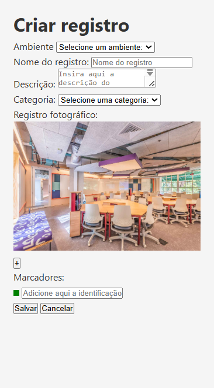

<div align="center">
</div>

<div align="center">
<sub>Fonte: autoria própria (2025)</sub>
</div>


### 4.1.3. Implementação do sistema de autenticação

Também realizamos a implementação do **sistema de autenticação**, permitindo a diferenciação entre os perfis de usuário: **inspetor** e **administrador**. Essa distinção é essencial para definir níveis de acesso e permissões específicas dentro da aplicação, garantindo maior segurança e controle.

<div align="center">
<sub>Figura X - Tela de autenticação</sub>
</div>

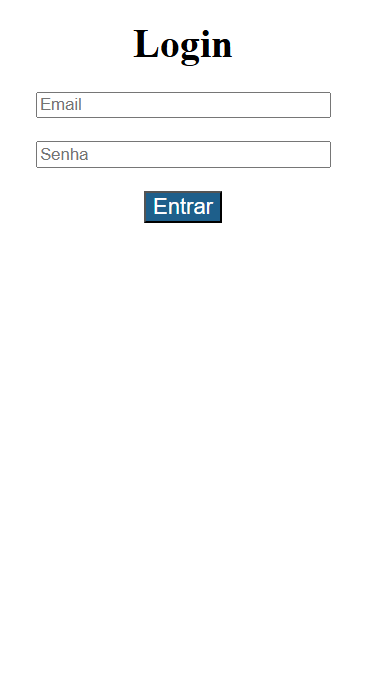

<div align="center">
</div>

<div align="center">
<sub>Fonte: autoria própria (2025)</sub>
</div>


### 4.1.4. Criação de componentes básicos

Iniciamos a construção de alguns componentes básicos que fazem parte da estrutura visual e funcional da aplicação, como o **header** e a **bottom navigation bar**, elementos fundamentais para a navegação do usuário.

A seguir, apresentamos uma imagem ilustrativa desses componentes em funcionamento:  

<div align="center">
<sub>Figura X - Criação de registro dentro da aplicação</sub>
</div>


<div align="center">
</div>

<div align="center">
<sub>Fonte: autoria própria (2025)</sub>
</div>


### 4.1.5. Conclusão

Encerramos esta sprint com uma base sólida para a aplicação, estruturando adequadamente a arquitetura MVC, conectando a aplicação ao banco de dados e implementando as funcionalidades iniciais de autenticação e navegação.

Nos próximos ciclos, pretendemos aprimorar o front-end utilizando **CSS** e **JavaScript** para melhorar a interatividade e a experiência do usuário. Planejamos implementar um design responsivo para garantir que a aplicação funcione de forma eficiente em dispositivos móveis e desktops. Além disso, expandiremos as funcionalidades da aplicação, como:

- **Criação de inspeções pelo administrador**: Permitiremos que o administrador configure novas inspeções diretamente pelo sistema, com opções para definir prazos, locais, equipes e prioridades. Essa funcionalidade será integrada ao dashboard administrativo, facilitando o gerenciamento das atividades.

- **Edição de imagens para o inspetor**: Implementaremos ferramentas de edição de imagens, permitindo que os inspetores adicionem marcadores, destaques e anotações diretamente nas fotos capturadas durante as inspeções. Isso ajudará a tornar os registros mais claros e detalhados.

- **Gerenciamento avançado de usuários**: Incluiremos funcionalidades para que o administrador possa gerenciar permissões e níveis de acesso dos usuários, garantindo maior controle sobre as ações realizadas no sistema.

- **Geração automatizada de relatórios**: Desenvolveremos a funcionalidade de exportação de relatórios de inspeção em formatos como **PDF** e **Excel**, permitindo que os dados sejam compartilhados e analisados de forma mais prática.

- **Notificações e alertas**: Adicionaremos um sistema de notificações para informar os usuários sobre prazos de inspeções, alterações de status e outras atualizações importantes.

- **Melhorias no fluxo de registro de inspeções**: Otimizaremos o processo de registro de patologias, tornando-o mais intuitivo e eficiente, com a possibilidade de adicionar múltiplos registros em uma única interação.

Essas melhorias visam atender às necessidades dos diferentes perfis de usuários, garantindo uma aplicação mais robusta, funcional e alinhada às demandas do mercado.


## 4.2. Segunda versão da aplicação web (sprint 4)

### 4.2.1. Estilização da aplicação web

Na segunda versão, a aplicação recebeu uma reformulação visual completa, seguindo o guia de estilos definido na sprint anterior. Foram aplicadas as cores institucionais do IPT, tipografia padronizada e componentes visuais consistentes, garantindo uma experiência mais moderna e profissional.

<div align="center">
<sub>Figura 1 - Tela inicial estilizada (mobile)</sub>
</div>
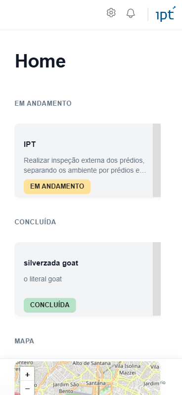
<div align="center"></div>
<div align="center">
<sub>Fonte: autoria própria (2025)</sub>
</div>

<div align="center">
<sub>Figura 2 - Tela inicial estilizada (desktop)</sub>
</div>
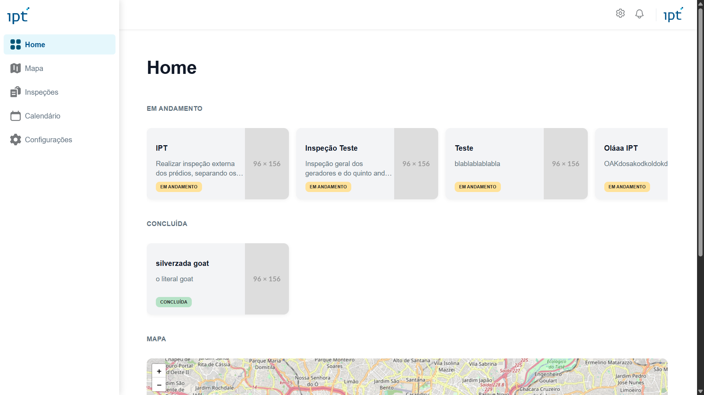
<div align="center"></div>
<div align="center">
<sub>Fonte: autoria própria (2025)</sub>
</div>

A responsividade foi aprimorada, permitindo que a aplicação se adapte perfeitamente a diferentes tamanhos de tela, tanto em dispositivos móveis quanto em desktops.

---

### 4.2.2. Novas funcionalidades implementadas

#### 4.2.2.1. Mapa de inspeções

Foi implementado um mapa interativo que exibe a localização de todas as inspeções cadastradas. O usuário pode visualizar rapidamente onde cada inspeção está sendo realizada, facilitando o planejamento logístico e a navegação até os locais.

<div align="center">
<sub>Figura 3 - Mapa de inspeções</sub>
</div>
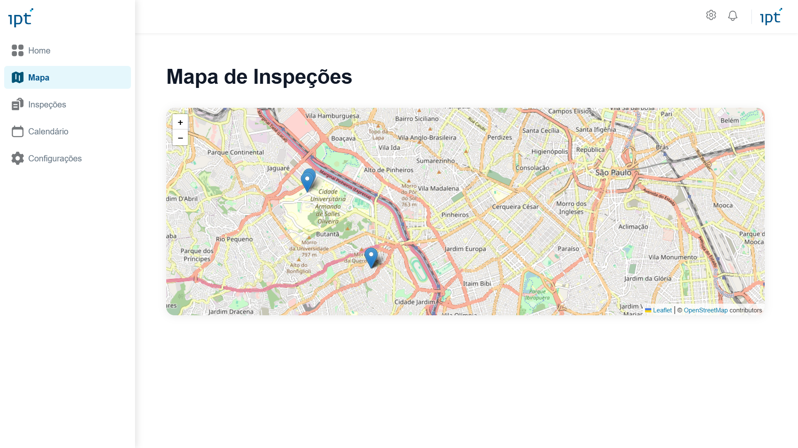
<div align="center"></div>
<div align="center">
<sub>Fonte: autoria própria (2025)</sub>
</div>

Ao clicar em um marcador, detalhes da inspeção são exibidos, incluindo endereço, status e equipe responsável.

#### 4.2.2.2. Calendário de inspeções

A aplicação agora conta com um calendário integrado, onde todas as inspeções agendadas são visualizadas por data. O calendário permite filtrar inspeções por status (em andamento, concluídas, pendentes) e acessar rapidamente os detalhes de cada uma.

<div align="center">
<sub>Figura 4 - Calendário de inspeções</sub>
</div>
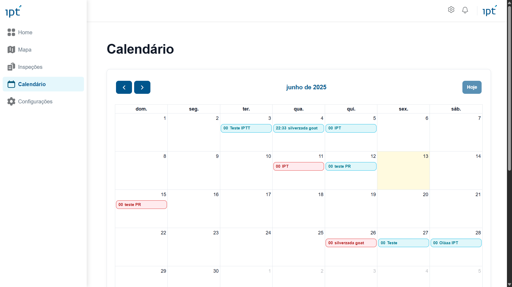
<div align="center"></div>
<div align="center">
<sub>Fonte: autoria própria (2025)</sub>
</div>

---

### 4.2.3. Navegação aprimorada

A navegação foi reorganizada para tornar o fluxo mais intuitivo. Um menu lateral (no desktop) e uma barra inferior (no mobile) facilitam o acesso às principais áreas: Home, Inspeções, Mapa, Calendário e Configurações.

<div align="center">
<sub>Figura 5 - Barra de navegação (mobile)</sub>
</div>

<div align="center"></div>
<div align="center">
<sub>Fonte: autoria própria (2025)</sub>
</div>

<div align="center">
<sub>Figura 6 - Menu lateral (desktop)</sub>
</div>
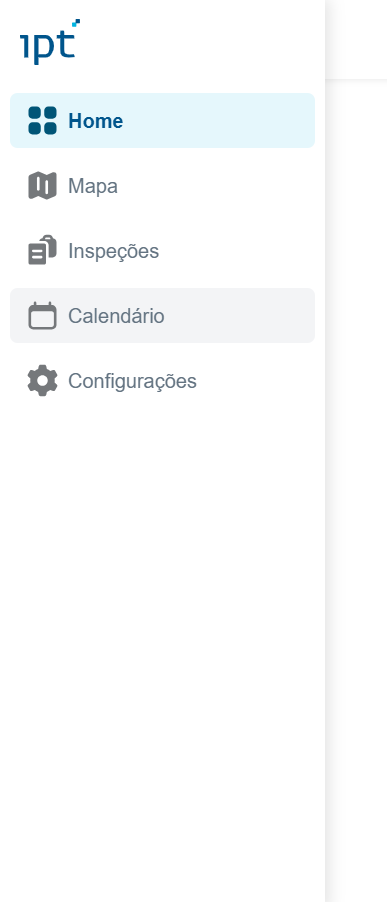
<div align="center"></div>
<div align="center">
<sub>Fonte: autoria própria (2025)</sub>
</div>

---

### 4.2.4. Fluxo do inspetor finalizado

O fluxo do inspetor foi totalmente implementado, permitindo que o usuário realize todas as etapas necessárias para registrar uma patologia.

#### 4.2.4.1. Autenticação

O sistema de login foi aprimorado, com feedback visual para erros e suporte a recuperação de senha.

<div align="center">
<sub>Figura 7 - Tela de login</sub>
</div>

<div align="center"></div>
<div align="center">
<sub>Fonte: autoria própria (2025)</sub>
</div>

#### 4.2.4.2. Home

A tela inicial exibe as inspeções atribuídas ao inspetor, com indicadores de status e acesso rápido às ações principais.

<div align="center">
<sub>Figura 8 - Home do inspetor</sub>
</div>

<div align="center"></div>
<div align="center">
<sub>Fonte: autoria própria (2025)</sub>
</div>

#### 4.2.4.3. Inspeções

O inspetor pode visualizar detalhes das inspeções, acessar ambientes, registros e imagens associadas.

<div align="center">
<sub>Figura 9 - Detalhes da inspeção</sub>
</div>
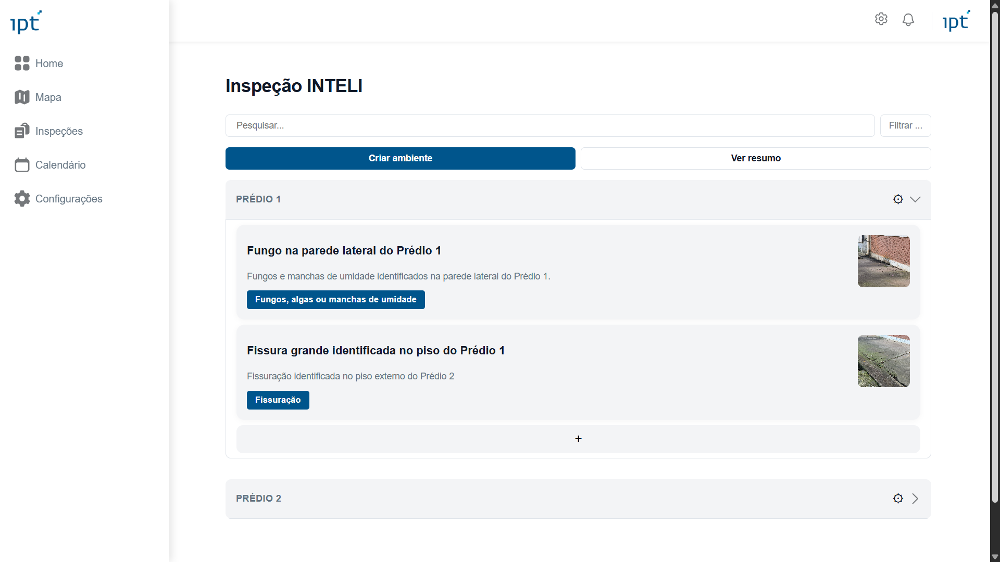
<div align="center"></div>
<div align="center">
<sub>Fonte: autoria própria (2025)</sub>
</div>

#### 4.2.4.4. Criar registro

Foi finalizada a tela de criação de registros, permitindo adicionar fotos, marcar patologias, inserir descrições e tags.

<div align="center">
<sub>Figura 10 - Criação de registro</sub>
</div>
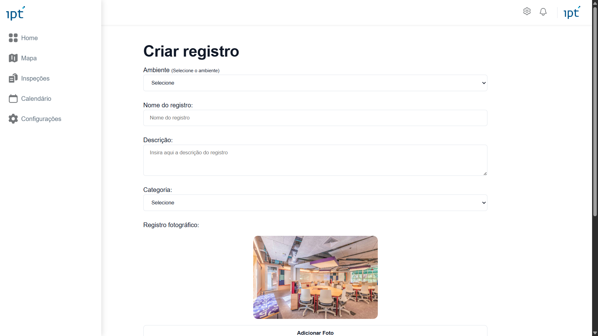
<div align="center"></div>
<div align="center">
<sub>Fonte: autoria própria (2025)</sub>
</div>

---

### 4.2.5. Criação de inspeção

O administrador pode criar novas inspeções diretamente pela interface, definindo endereço, datas, equipes e prioridades. O formulário foi otimizado para facilitar o preenchimento e reduzir erros.

<div align="center">
<sub>Figura 11 - Tela de criação de inspeção</sub>
</div>
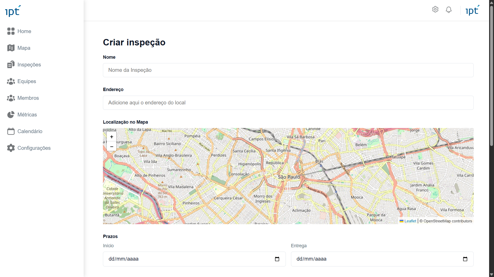
<div align="center"></div>
<div align="center">
<sub>Fonte: autoria própria (2025)</sub>
</div>

---

### 4.2.6. Configurações

#### 4.2.6.1 Configurações gerais

A seção de configurações permite ao usuário editar seu perfil, alterar senha, definir preferências de notificação e idioma.

<div align="center">
<sub>Figura 12 - Configurações gerais</sub>
</div>
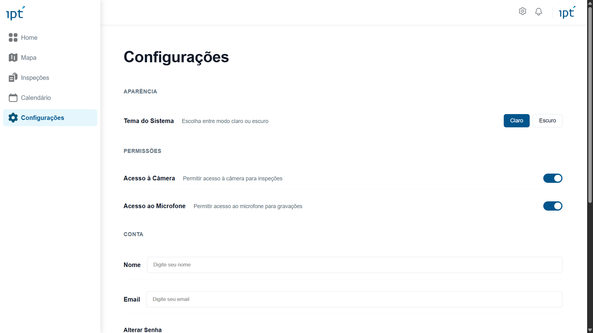
<div align="center"></div>
<div align="center">
<sub>Fonte: autoria própria (2025)</sub>
</div>

#### 4.2.6.2 Tema escuro

Foi implementada a opção de tema escuro, proporcionando maior conforto visual em ambientes de pouca luz. O usuário pode alternar entre os temas a qualquer momento.

<div align="center">
<sub>Figura 13 - Tema escuro ativado</sub>
</div>
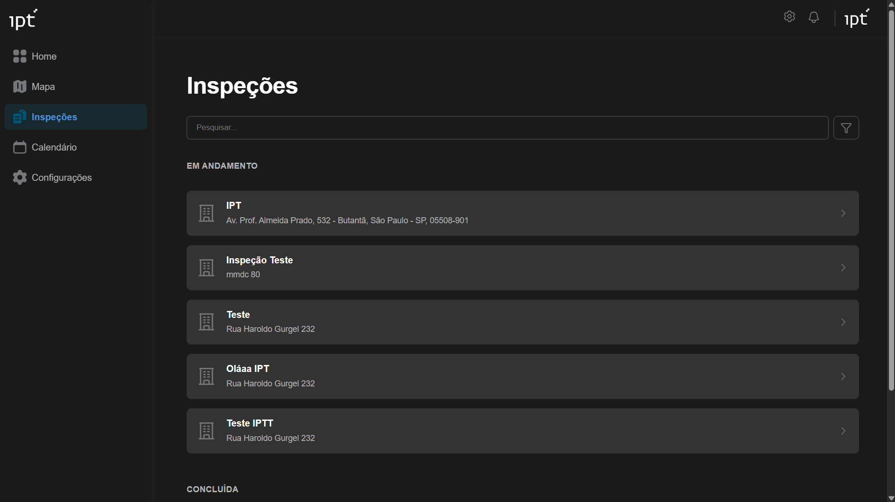
<div align="center"></div>
<div align="center">
<sub>Fonte: autoria própria (2025)</sub>
</div>

---

Com essas melhorias, a segunda versão da aplicação web apresenta uma experiência mais fluida, visualmente agradável e funcional, atendendo às necessidades dos diferentes perfis de usuários e preparando o sistema para as próximas etapas de validação e testes.


## 4.3. Versão final da aplicação web (sprint 5)

_Descreva e ilustre aqui o desenvolvimento da última versão do sistema web, explicando brevemente o que foi entregue em termos de código e sistema. Utilize prints de tela para ilustrar. Indique as eventuais dificuldades e próximos passos._

# <a name="c5"></a>5. Testes

## 5.1. Relatório de testes de integração de endpoints automatizados (sprint 4)

Para a nossa aplicação web, estamos utilizando de testes automatizados. Os testes permitem com que seja possível validar e verificar os diferentes aspectos da aplicação também de acordo com o modelo MVC. Por isso, planejamos testes para os Models, Services, Controllers e Routes do projeto, garantindo uma cobertura geral e eficiente. Os testes estão localizados na pasta _tests_, dentro de src. Para a realização desses testes na sua máquina, basta utilizar o comando npm install para instalar as dependências, e npm run test para executá-los.

Após a execução dos testes, uma pasta chamada coverage será gerada. Nela, é possível acessar os relatórios completos dos testes feitos. O resultado de nossos testes até o momento pode ser visto à seguir:

<div align="center">
<sub>Figura X - Resultado dos testes automatizados</sub>

</div>

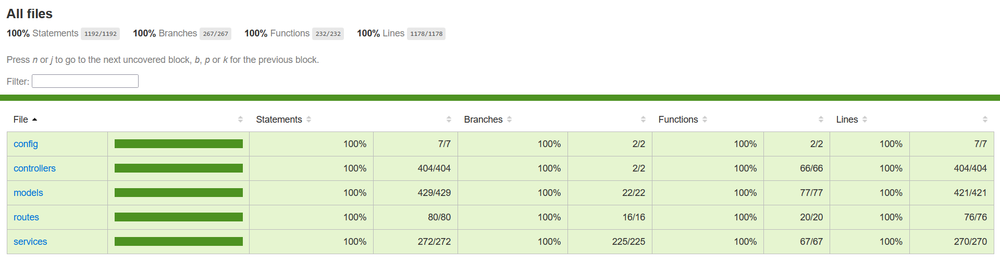

<div align="center">
</div>

<div align="center">
<sub>Fonte: autoria própria (2025)</sub>
</div>

## 5.2. Testes de usabilidade (sprint 5)

_Posicione aqui as tabelas com enunciados de tarefas, etapas e resultados de testes de usabilidade. Ou utilize um link para seu relatório de testes (mantenha o link sempre público para visualização)_

# <a name="c6"></a>6. Estudo de Mercado e Plano de Marketing (sprint 4)
O Estudo de Mercado e o Plano de Marketing foram utilizados como ferramentas estratégicas para orientar a tomada de decisões no desenvolvimento da aplicação web CLOUDing, com o objetivo de garantir aderência ao setor de inspeções prediais e viabilidade de negócio no médio e longo prazo. Essas ferramentas permitiram a compreensão aprofundada do contexto econômico e tecnológico do setor, a análise da concorrência, a definição do público-alvo e a elaboração de estratégias comerciais sustentáveis.

De acordo com a literatura em administração e marketing estratégico (Kotler & Keller, 2021), a construção de soluções tecnológicas orientadas ao mercado depende de uma análise consistente do ambiente externo, da identificação de lacunas operacionais e da proposição de valor clara e validada com usuários reais. No caso da CLOUDing, esse processo foi conduzido com foco nas dores enfrentadas por engenheiros civis durante inspeções em realizadas pelo Instituto de Pesquisas Tecnológicas (IPT).

Diante desse cenário, o presente estudo foi estruturado para embasar o posicionamento da CLOUDing como uma solução técnica, confiável e escalável. A seguir, apresentam-se as análises realizadas sobre o mercado-alvo, os concorrentes, os segmentos atendidos, o diferencial estratégico da aplicação e as ações de marketing propostas.

## 6.1 Resumo Executivo

A aplicação web **CLOUDing** surge como uma resposta aos principais desafios enfrentados por engenheiros civis durante inspeções prediais, especialmente em instituições públicas como o Instituto de Pesquisas Tecnológicas (IPT). A ausência de padronização, a fragmentação das informações e a dificuldade em consolidar dados e imagens tornam o processo de vistoria moroso, propenso a erros e pouco rastreável. CLOUDing propõe uma solução digital centralizada, responsiva e colaborativa, capaz de registrar evidências técnicas com precisão, incluindo imagens geolocalizadas e datadas, relatórios padronizados e controle de permissões por usuário.

Oportunidades de mercado foram identificadas tanto no setor público quanto privado, considerando o crescimento da digitalização no setor da construção civil, a valorização da manutenção predial preventiva e a exigência crescente por conformidade técnica e legal. A principal vantagem competitiva da CLOUDing está na simplicidade de uso aliada à robustez técnica e à capacidade de personalização para diferentes perfis de cliente.

Atualmente, o projeto encontra-se em fase de desenvolvimento da segunda versão funcional da aplicação, com previsão de MVP finalizado nas próximas quatro semanas. A validação já realizada com engenheiros do IPT reforça o alinhamento da solução com as demandas reais do setor. Os objetivos estratégicos incluem o lançamento de um modelo de assinatura escalonável, com planos para engenheiros independentes, construtoras e empresas de médio a grande porte. A proposta é consolidar-se como a principal ferramenta brasileira para inspeção predial digital, aproveitando a baixa penetração de concorrentes nacionais e o vínculo institucional com o IPT como base para escalar a adoção da plataforma.

## 6.2 Análise de Mercado

### 6.2.1 Visão Geral do Setor
O setor de inspeção predial insere-se no contexto mais amplo da construção civil e da engenharia diagnóstica. A inspeção periódica de edificações é fundamental para garantir segurança, funcionalidade e conformidade legal, especialmente em grandes centros urbanos onde a verticalização e o envelhecimento das estruturas impõem desafios técnicos cada vez maiores. No Brasil, a regulamentação ainda é incipiente em comparação com países como França e Canadá, mas cidades como São Paulo e Salvador já exigem laudos técnicos periódicos para edificações com mais de cinco anos de uso (IBAPE-SP, 2023).

### 6.2.2 Tamanho e Crescimento do Mercado
No aspecto tecnológico, o setor passa por um processo de digitalização acelerado, com o crescimento de plataformas digitais voltadas para gestão de obras, manutenção e diagnósticos. Ainda assim, muitas atividades são feitas com pranchetas, planilhas e registros manuais, revelando uma lacuna entre as práticas ideais e o cotidiano dos profissionais. Esse gap representa uma oportunidade significativa para soluções digitais como a CLOUDing.

Estima-se que o nicho de manutenção e inspeções técnicas movimente cerca de R$ 60 bilhões por ano no Brasil, com mais de 15 milhões de serviços realizados anualmente (APC, 2024). No mercado internacional, o setor de Testes, Inspeções e Certificações (TIC) deve atingir US$ 58,76 bilhões até 2029, com crescimento anual médio de 10,3% (Mordor Intelligence, 2024), reforçando a tendência global de digitalização nesse tipo de serviço.

### 6.2.3 Tendências de Mercado
Do ponto de vista econômico, o setor da construção civil representa cerca de 6,2% do PIB brasileiro (CBIC, 2024), sendo um dos que mais empregam e movimentam cadeias produtivas diversas. A manutenção e inspeção predial, embora menos visíveis, é um nicho promissor, especialmente diante do envelhecimento do parque imobiliário urbano. A transição para ferramentas digitais que facilitem esse processo tem se mostrado uma tendência global.

## 6.3 Análise da Concorrência

### 6.3.1 Principais Concorrentes

O mercado de soluções para inspeções prediais conta com alguns concorrentes diretos e indiretos que oferecem sistemas de gestão de vistorias, laudos técnicos e manutenção de edificações. Entre os principais concorrentes diretos destacam-se plataformas como **Construct App**, **PlanRadar**, **Field Control** e **Archire Port**. Esses sistemas oferecem funcionalidades como checklist digital, upload de imagens, armazenamento em nuvem e geração de relatórios automáticos.

No entanto, muitos desses sistemas têm foco mais generalista para a construção civil como um todo, com menor especialização nas necessidades técnicas de instituições públicas de pesquisa e inspeção, como o IPT.

O posicionamento dos concorrentes tende a priorizar a usabilidade para o setor privado da construção civil, com foco em empresas contratadas para obras ou manutenções preventivas. Assim, existe uma lacuna significativa no mercado por soluções voltadas especificamente para inspeções técnicas rigorosas, conduzidas por entidades públicas ou institutos de pesquisa.

### 6.3.2 Vantagens Competitivas da Aplicação Web

A aplicação web desenvolvida apresenta diferenciais claros em relação aos concorrentes. Enquanto outras plataformas priorizam uma abordagem genérica voltada ao setor privado, a solução proposta foi desenvolvida sob medida para atender às demandas específicas do IPT, principalmente as do **Laboratório de Tecnologia e Desempenho e Sistemas Construtivos (LTDC)**. Isso garante maior aderência aos fluxos de trabalho reais e maior conformidade com padrões técnicos utilizados na inspeção de edificações.

Dentre as principais vantagens competitivas estão:

- A integração direta de imagens com descrições técnicas;
- O armazenamento e organização estruturada dos dados para geração de relatórios técnicos;
- A eliminação do processo manual, o que reduz erros, aumenta a agilidade e melhora a rastreabilidade das informações.

Além disso, por ser uma solução personalizada, a aplicação permite evoluções contínuas baseadas no feedback da equipe do IPT, algo que plataformas genéricas não oferecem com a mesma flexibilidade. Também se destaca por buscar uma interface simples, voltada à produtividade e otimizada para o uso em campo por técnicos e engenheiros.

Essa flexibilidade está alinhada ao contexto competitivo do setor, em que a rivalidade entre concorrentes é considerada **moderada a alta**, mas é mitigada pela **forte presença institucional do IPT**, o que favorece a consolidação de soluções internas frente às alternativas do mercado — mas isso pode ser melhor explicado e desenvolvido na [seção 2.1.1](#rivalidade-entre-concorrentes-moderada-alta).

## 6.4 Público-Alvo

### 6.4.1 Segmentação de Mercado

A aplicação web atende, inicialmente, ao segmento de engenheiros civis autônomos e empresas especializadas em inspeções prediais, com foco em edificações públicas e privadas. Este mercado é marcado por baixa digitalização, forte dependência de processos manuais e necessidade de padronização técnica. Segundo o Sebrae (2024), o setor da construção civil no Brasil é composto majoritariamente por profissionais independentes e pequenas empresas, o que reforça a aderência da aplicação a esse perfil.

A validação com engenheiros do Instituto de Pesquisas Tecnológicas (IPT) garantiu o alinhamento da solução com a rotina de inspeções reais, assegurando credibilidade técnica.

Além dos engenheiros, a solução se expande para os seguintes segmentos:

- Construtoras de pequeno e médio porte que realizam inspeções internas de qualidade;
- Empresas de manutenção predial e síndicos profissionais que necessitam documentar laudos técnicos e vistorias regulares;
- Órgãos públicos, como prefeituras e secretarias de obras, que contratam serviços por meio de licitações.

Essa segmentação abrange setores com alta responsabilidade legal, exigência de rastreabilidade documental e necessidade crescente por eficiência técnica, características que tornam a aplicação indispensável em processos críticos de manutenção e segurança predial.

### 6.4.2 Perfil do Público-Alvo_

O público-alvo inicial da CLOUDing é composto por engenheiros civis que trabalham no IPT, envolvidos na gestão, manutenção e fiscalização de edificações, com foco em inspeções prediais. Além disso, a aplicação é desenvolvida para profissionais que atuam de forma autônoma ou como prestadores de serviço para órgãos públicos. Esses profissionais possuem nível superior completo, estão concentrados em regiões metropolitanas e têm entre 30 e 60 anos, conforme o perfil médio da engenharia brasileira (CREA-SP, 2023).

Comportamentalmente, são profissionais que:

- Enfrentam pressões por agilidade, precisão e responsabilidade técnica;
- Trabalham com prazos curtos e alto volume de inspeções;
- Precisam gerar relatórios auditáveis, compatíveis com normas como a ABNT NBR 16747:2020.

Psicograficamente, valorizam:

- Ferramentas que otimizem o tempo de campo;
- Soluções seguras, com registro confiável das informações;
- Inovação com base em experiências reais, como a validação feita por engenheiros do IPT.

Necessidades específicas incluem:

- Evitar retrabalho por erros manuais;
- Facilitar o acesso remoto e centralizado a dados e relatórios;
- Cumprir exigências legais e contratuais em obras públicas e privadas.

No médio prazo, o público-alvo pode se expandir para síndicos profissionais, empresas de manutenção predial e construtoras, que compartilham as mesmas dores em relação à documentação, controle técnico e conformidade normativa.

## 6.5 Posicionamento

### 6.5.1 Proposta de Valor Única
O grupo CLOUDing está desenvolvendo uma aplicação web focada na digitalização de inspeções prediais com o objetivo de transformar processos manuais e descentralizados em fluxos automatizados, integrados e padronizados.

O projeto propõe uma solução que, em um único ambiente digital, permitirá a captura e organização de imagens, o registro estruturado de dados técnicos, a descrição padronizada de patologias e a geração automática de relatórios das inspeções. Desse modo, será possível reduzir significativamente o tempo de execução, minimizar falhas humanas e elevar a qualidade técnica das entregas.

Projetada com com uma estrutura que permite fácil expansão e funcionamento online, sem a necessidade de instalação local, a aplicação estpa sendo devolvida inicialmente para atender às demandas do Instituto de Pesquisas Tecnológicas (IPT), mas com visando atender também, no longo prazo, engenheiros independentes, empresas privadas e órgãos públicos. A solução busca oferecer rastreabilidade de dados, compatibilidade com múltiplos formatos de exportação e conformidade com exigências técnicas e normativas, tornando-se adaptável a diferentes contextos operacionais do setor.

Sua construção vem sendo guiada por um processo contínuo de validação quinzenal com especialistas do IPT, incluindo engenheiros da área técnica, profissionais de negócios e lideranças de TI. Com base nessas interações, a aplicação em desenvolvimento pelo grupo CLOUDing propõe não apenas digitalizar etapas já existentes, mas reformular de forma estruturada a experiência completa de inspeção predial, com foco na redução de erros e na consolidação de um histórico técnico acessível e confiável."


### 6.5.2 Estratégia de Diferenciação
A estratégia de diferenciação do grupo CLOUDing está sendo estruturada com base em três pilares fundamentais, alinhados às necessidades específicas do setor de inspeções prediais e aos objetivos do projeto em parceria com o IPT, sendo eles:

1. Especialização vertical: Diferentemente de soluções genéricas, o CLOUDing está desenvolvendo uma aplicação com foco exclusivo em inspeções prediais, permitindo a implementação de funcionalidades técnicas específicas e maior aderência aos fluxos de trabalho do setor.

2. Desenvolvimento orientado por evidências práticas: Todas as funcionalidades estão sendo desenhadas com base em validações diretas de gargalos operacionais em ambientes reais de inspeção com especialistas da área. Dessa forma, é possível garantir que cada componente da solução responda a demandas concretas, em vez de apenas hipóteses de mercado.

3. Plataforma web: A aplicação será 100% baseada em nuvem, garantindo acesso remoto, atualizações automáticas e integração com ferramentas institucionais já utilizadas. Essa decisão técnica reduzirá custos operacionais e facilitará a adoção por equipes diversas, inclusive em contextos com infraestrutura limitada.

Com essa abordagem, o CLOUDing busca posicionar a aplicação em desenvolvimento como uma referência futura no setor, destacando-se pela combinação entre especialização técnica e praticidade operacional, em contraste com plataformas amplas, porém superficiais.

## 6.6 Estratégia de Marketing

### 6.6.1 Produto/Serviço
O produto foi desenvolvido com base na análise dos principais desafios enfrentados por engenheiros durante inspeções prediais, especialmente em instituições públicas, tais como o Instituto de Pesquisas Tecnológicas (IPT). Os principais problemas identificados foram: retrabalho causado pela perda ou ou coleta incompleta de dados, falta de padronização nos métodos de anotação e elaboração de relatórios, ausência de um histórico consolidado de inspeções anteriores, e descentralização das informações, frequentemente distribuídas entre planilhas, cadernos, aplicativos diversos ou dispositivos pessoais.
Para solucionar essas questões, estamos desenvolvendo uma aplicação web responsiva, acessível por computadores e dispositivos móveis. A solução visa oferecer um ambiente centralizado e seguro para o armazenar os dados coletados, permitindo o acesso e a colaboração entre membros da equipe conforme suas permissões. Também estão sendo implementados formulários padronizados, que asseguram uniformidade na coleta de informações, o que contribui para o mapeamento, metrificação e comprovação técnica.
Com essas funcionalidades, o produto busca proporcionar maior agilidade, segurança e centralização ao processo de inspeção predial, atendendo às necessidades do IPT e de potenciais consumidores, como empresas privadas, construtoras e engenheiros autônomos.

### 6.6.2 Preço
Caso o produto fosse comercializado, a estratégia mais adequada seria a adoção do modelo de assinatura mensal. A análise do mercado revelou que esse formato é amplamente utilizado por ferramentas semelhantes, como o Archireport, plataforma francesa voltada a inspeções em obras, que cobra mensalidades pelo uso contínuo do sistema.
Esse modelo oferece benefícios relevantes, como a geração de receita recorrente, garantindo maior previsibilidade financeira e viabilizando a manutenção e evolução contínua da aplicação. Além disso, permite a segmentação de ofertas por meio de planos distintos, ajustando o valor cobrado ao perfil e às necessidades de cada cliente. Por exemplo, um plano básico para engenheiros independentes, um plano intermediário para pequenas construtoras e um plano empresarial para grandes empresas ou órgãos públicos, com recursos adicionais e suporte ampliado.
Trata-se de uma abordagem compatível com as práticas do mercado de softwares de gestão técnica e com o perfil do público-alvo, reforçando sua viabilidade comercial.

### 6.6.3 Praça
A estratégia de distribuição será inteiramente digital, priorizando canais com baixa barreira de entrada e alto potencial de segmentação. Anúncios no LinkedIn serão um dos principais meios, devido à sua capacidade de segmentar por profissão, cargo e área de atuação – alcançando engenheiros civis, arquitetos, gestores de obra e tomadores de decisão em empresas de engenharia e órgãos públicos.
Além disso, campanhas patrocinadas no Google permitirão que profissionais encontrem a solução ao buscarem termos como “software para inspeção predial” ou “plataforma para vistorias técnicas”. 
Também serão firmadas parcerias estratégicas com instituições como o IPT, universidades e associações de engenharia, que poderão recomendar a plataforma a seus membros.
Como os concorrentes atuam nos mesmos canais, será essencial diferenciar a solução desde o primeiro contato, exigindo um esforço de venda centrado em comunicação clara, objetiva e com forte apelo visual. Sendo assim, pensamos também na utilização da captação por meio de um outbound, que seria uma estratégia ideal para captação de leads B2B, onde atendentes tem como sua função principal entrar em contato com empresas e ofertar a nossa solução.

### 6.6.4 Promoção
A estratégia de promoção foi definida com foco em educar, demonstrar valor e gerar confiança no público-alvo, utilizando ações de alto impacto e baixo custo. Para isso, optou-se por campanhas patrocinadas no LinkedIn, destacando benefícios como padronização, agilidade e centralização de dados.
Além disso, será oferecida uma versão gratuita com duração entre 7 e 30 dias, permitindo que o cliente experimente a ferramenta antes de optar pela assinatura. Essa abordagem segue uma prática consolidada no mercado e adotada por ferramentas similares, como o Archireport, que utilizam estratégias de testes gratuitos, vídeos curtos e depoimentos para atrair e converter usuários. Assim, a oferta da versão gratuita se alinha às táticas bem-sucedidas do setor e reforça o posicionamento da nossa solução como uma alternativa competitiva e confiável.

# <a name="c7"></a>7. Conclusões e trabalhos futuros (sprint 5)

_Escreva de que formas a solução da aplicação web atingiu os objetivos descritos na seção 2 deste documento. Indique pontos fortes e pontos a melhorar de maneira geral._

_Relacione os pontos de melhorias evidenciados nos testes com planos de ações para serem implementadas. O grupo não precisa implementá-las, pode deixar registrado aqui o plano para ações futuras_

_Relacione também quaisquer outras ideias que o grupo tenha para melhorias futuras_

# <a name="c8"></a>8. Referências (sprints 1 a 5)

AMAZON WEB SERVICES. A diferença entre modelo de dados lógico e físico. Disponível em: <https://aws.amazon.com/pt/compare/the-difference-between-logical-and-physical-data-model/>. Acesso em: 13 maio 2025.

CBIC (Câmara Brasileira da Indústria da Construção).
Construção civil cresce 4,3% em 2024 e impulsiona economia nacional. Brasília: CBIC, 2024. Disponível em: https://cbic.org.br/construcao-civil-cresce-43-em-2024-e-impulsiona-economia-nacional/. Acesso em: 21 maio 2025.

CBIC (Câmara Brasileira da Indústria da Construção).
Desempenho da construção civil em 2024 e perspectivas para 2025. Brasília: CBIC, 2024. Disponível em: https://cbic.org.br/wp-content/uploads/2024/12/final-desempenho-economico-cc-dezembro-2024.pdf. Acesso em: 21 maio 2025.

GUIMARÃES, Felipe; EQUIPE AELA. Style Guide: Como Desenvolver o Guia de Estilo da Sua Interface?. Disponível em: https://www.aela.io/pt-br/blog/conteudos/style-guide-como-desenvolver-o-guia-de-estilo-da-sua-interface. Acesso em: 26 maio 2025.

IBAPE-SP (Instituto Brasileiro de Avaliações e Perícias de Engenharia de São Paulo).
CARTILHA DE INSPEÇÃO PREDIAL – Sistemas AVAC-R. São Paulo: IBAPE-SP, 2023. Disponível em: https://ibape-sp.org.br/adm/upload/uploads/1700337253-MINUTA%20-%20Cartilha%20Inspecao%20Predial%20-%20Sistemas%20AVAC.pdf. Acesso em: 21 maio 2025.

INSTITUTO DE PESQUISAS TECNOLÓGICAS. Quem somos. Disponível em: https://ipt.br/quem-somos/. Acesso em: 23 abr. 2025.

MAGRETTA, Joan. Compreendendo Michael Porter: o guia essencial para competição e estratégia. Tradução de Afonso Celso da Cunha Serra. Rio de Janeiro: Alta Books, 2019. Disponível em: https://integrada.minhabiblioteca.com.br/reader/books/9788550805047/pageid/53. Acesso em: 23 abr. 2025.

NIELSEN NORMAN GROUP. Personas. Disponível em: https://www.nngroup.com/articles/persona/. Acesso em: 29 abr. 2025.

OSTERWALDER, Alexander et al. Value proposition design: How to create products and services customers want. John Wiley & Sons, 2014.

REVISTA ENSINO SUPERIOR. Novos concorrentes das IES. 2022. Disponível em: https://revistaensinosuperior.com.br/2022/09/23/novos-concorrentes-das-ies/. Acesso em: 23 abr. 2025.

SÃO PAULO (Estado). Instituto de Pesquisas Tecnológicas do Estado de São Paulo – Balanço Patrimonial 2023. Imprensa Oficial. Disponível em: https://empresaspublicas.imprensaoficial.com.br/balancos/ipt/ipt2023.pdf. Acesso em: 23 abr. 2025.

SEESP – SINDICATO DOS ENGENHEIROS NO ESTADO DE SÃO PAULO. IPT: há 125 anos gerando inovação para a indústria. 2021. Disponível em: https://www.seesp.org.br/site/jornal-do-engenheiro/item/22714-ipt-ha-125-anos-gerando-inovacao-para-a-industria. Acesso em: 23 abr. 2025.

GOOGLE CLOUD. O que é um banco de dados relacional? Disponível em: https://cloud.google.com/learn/what-is-a-relational-database?hl=pt-BR. Acesso em: 13 maio 2025.

APC – ASSOCIAÇÃO BRASILEIRA DE PRESTADORES DE SERVIÇOS DE CONSERVAÇÃO. Panorama do mercado de manutenção no Brasil. 2024. Disponível em: https://apcbrasil.org.br/panorama. Acesso em: 4 jun. 2025.

MORDOR INTELLIGENCE. Testing, Inspection, and Certification (TIC) Market – Growth, Trends, Forecasts (2024–2029). 2024. Disponível em: https://www.mordorintelligence.com/industry-reports/tic-market. Acesso em: 4 jun. 2025.

Sebrae (2024); IPT; IBGE; ABNT NBR 16747:2020.

CREA-SP (2023), Sebrae (2024), ABNT, IPT.

KOTLER, Philip; KELLER, Kevin Lane. Administração de Marketing. 16. ed. São Paulo: Pearson Education, 2021.


# <a name="c9"></a>Anexos

_Inclua aqui quaisquer complementos para seu projeto, como diagramas, imagens, tabelas etc. Organize em sub-tópicos utilizando headings menores (use ## ou ### para isso)_
